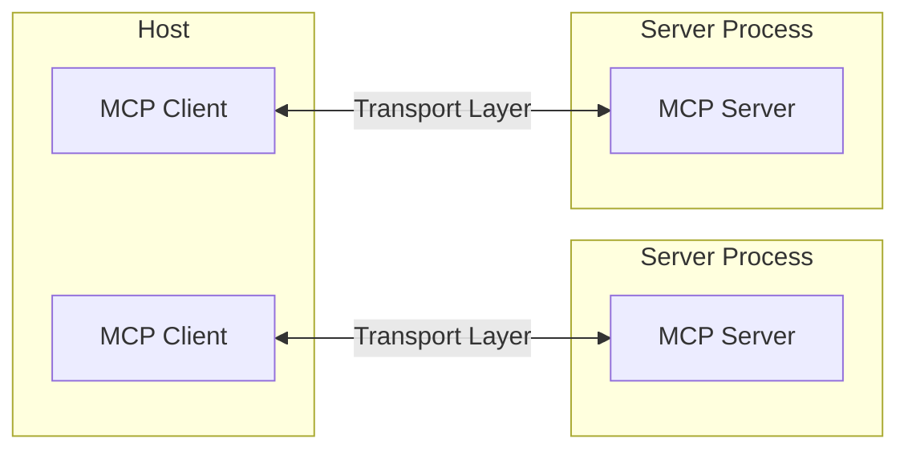
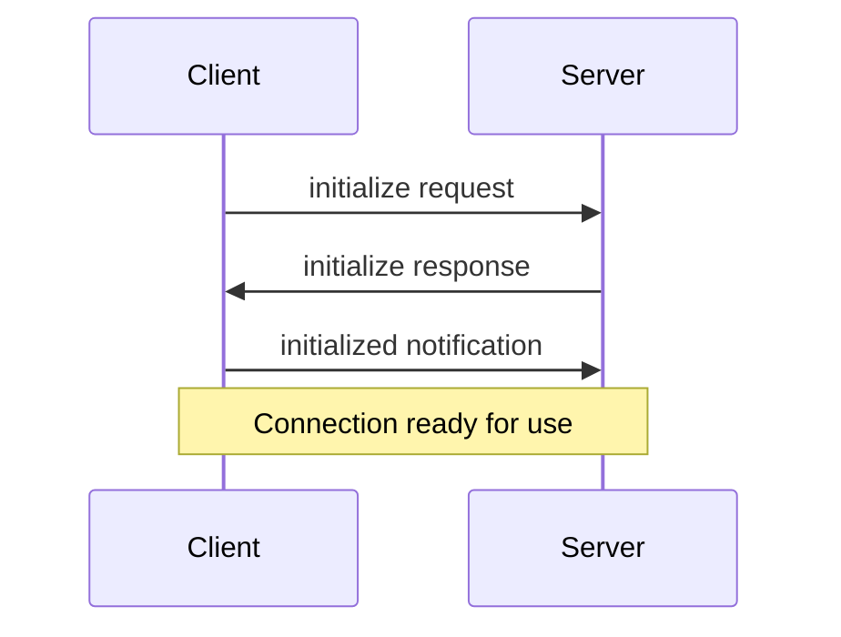

模型上下文协议（MCP）基于灵活可扩展的架构构建，实现大模型应用与集成间的无缝通信。本文档阐述核心架构组件与设计理念。

## 概述

MCP采用客户端-服务器架构：

- **宿主应用**指代发起连接的大模型应用（如Claude Desktop或IDE开发环境）
- **客户端**在宿主应用内部与服务器保持1:1连接
- **服务器**为客户端提供上下文、工具及提示词支持



## 核心组件

### 协议层

协议层负责消息帧处理、请求/响应关联及高层通信模式管理。
<Tabs>
  <Tab title="TypeScript">
    ```typescript
    class Protocol<Request, Notification, Result> {
        // Handle incoming requests
        setRequestHandler<T>(schema: T, handler: (request: T, extra: RequestHandlerExtra) => Promise<Result>): void

        // Handle incoming notifications
        setNotificationHandler<T>(schema: T, handler: (notification: T) => Promise<void>): void

        // Send requests and await responses
        request<T>(request: Request, schema: T, options?: RequestOptions): Promise<T>

        // Send one-way notifications
        notification(notification: Notification): Promise<void>
    }
    ```
  </Tab>
  <Tab title="Python">
    ```python
    class Session(BaseSession[RequestT, NotificationT, ResultT]):
        async def send_request(
            self,
            request: RequestT,
            result_type: type[Result]
        ) -> Result:
            """Send request and wait for response. Raises McpError if response contains error."""
            # Request handling implementation

        async def send_notification(
            self,
            notification: NotificationT
        ) -> None:
            """Send one-way notification that doesn't expect response."""
            # Notification handling implementation

        async def _received_request(
            self,
            responder: RequestResponder[ReceiveRequestT, ResultT]
        ) -> None:
            """Handle incoming request from other side."""
            # Request handling implementation

        async def _received_notification(
            self,
            notification: ReceiveNotificationT
        ) -> None:
            """Handle incoming notification from other side."""
            # Notification handling implementation
    ```
  </Tab>
</Tabs>

关键类包括：

* `Protocol`
* `Client`
* `Server`

### 传输层

传输层处理客户端与服务器间的实际通信。MCP支持多种传输机制：

1. **标准输入输出传输**
   - 通过标准输入/输出进行通信
   - 适用于本地进程场景

2. **HTTP SSE传输**
   - 使用服务器推送事件(Server-Sent Events)实现服务端到客户端消息
   - 通过HTTP POST实现客户端到服务端消息

所有传输均采用[JSON-RPC](https://www.jsonrpc.org/) 2.0协议交换消息。详见[规范文档](/specification/)获取模型上下文协议消息格式的详细信息。

### 消息类型

MCP定义以下主要消息类型：

1. **请求消息**需要接收方响应：
    ```typescript
    interface Request {
      method: string;
      params?: { ... };
    }
    ```

2. **结果消息**表示请求成功响应：
    ```typescript
    interface Result {
      [key: string]: unknown;
    }
    ```

3. **错误消息**表示请求处理失败：
    ```typescript
    interface Error {
      code: number;
      message: string;
      data?: unknown;
    }
    ```

4. **通知消息**为单向消息无需响应：
    ```typescript
    interface Notification {
      method: string;
      params?: { ... };
    }
    ```

## 连接生命周期

### 1. 初始化阶段



1. 客户端发送`initialize`请求，携带协议版本与能力参数
2. 服务端返回自身协议版本与能力参数
3. 客户端发送`initialized`通知作为确认
4. 开始正常消息交换

### 2. 消息交换阶段

初始化完成后支持以下模式：

- **请求-响应模式**：客户端或服务端发送请求，另一方返回响应
- **通知模式**：任一方发送单向消息

### 3. 终止阶段

任一方均可终止连接：
- 通过`close()`指令优雅关闭
- 传输层断开
- 错误状态触发

## 错误处理

MCP定义以下标准错误码：

```typescript
enum ErrorCode {
  // Standard JSON-RPC error codes
  ParseError = -32700,
  InvalidRequest = -32600,
  MethodNotFound = -32601,
  InvalidParams = -32602,
  InternalError = -32603
}
```

SDK和应用程序可自定义-32000以上的错误码。

错误通过以下途径传递：
- 请求的错误响应
- 传输层的错误事件
- 协议级错误处理器

## 实现示例

基础MCP服务端实现示例：

  <Tab title="TypeScript">
    ```typescript
    import { Server } from "@modelcontextprotocol/sdk/server/index.js";
    import { StdioServerTransport } from "@modelcontextprotocol/sdk/server/stdio.js";

    const server = new Server({
      name: "example-server",
      version: "1.0.0"
    }, {
      capabilities: {
        resources: {}
      }
    });

    // Handle requests
    server.setRequestHandler(ListResourcesRequestSchema, async () => {
      return {
        resources: [
          {
            uri: "example://resource",
            name: "Example Resource"
          }
        ]
      };
    });

    // Connect transport
    const transport = new StdioServerTransport();
    await server.connect(transport);
    ```
  </Tab>
  <Tab title="Python">
    ```python
    import asyncio
    import mcp.types as types
    from mcp.server import Server
    from mcp.server.stdio import stdio_server

    app = Server("example-server")

    @app.list_resources()
    async def list_resources() -> list[types.Resource]:
        return [
            types.Resource(
                uri="example://resource",
                name="Example Resource"
            )
        ]

    async def main():
        async with stdio_server() as streams:
            await app.run(
                streams[0],
                streams[1],
                app.create_initialization_options()
            )

    if __name__ == "__main__":
        asyncio.run(main())
    ```
  </Tab>

## 最佳实践

### 传输选择

1. **本地通信**
   - 本地进程间使用标准输入输出传输
   - 同机通信效率最佳
   - 进程管理简单

2. **远程通信**
   - 需要HTTP兼容性时采用SSE传输
   - 需考虑认证鉴权等安全因素

### 消息处理

1. **请求处理**
   - 严格校验输入参数
   - 使用类型安全模式
   - 优雅处理错误
   - 实现超时机制

2. **进度报告**
   - 长时操作使用进度令牌
   - 增量式进度汇报
   - 已知总进度时需包含

3. **错误管理**
   - 使用恰当错误码
   - 包含有效错误信息
   - 错误时清理资源

## 安全考量

1. **传输安全**
   - 远程连接启用TLS加密
   - 验证连接来源
   - 按需实现认证机制

2. **消息验证**
   - 校验所有入站消息
   - 输入参数消毒
   - 检查消息大小限制
   - 验证JSON-RPC格式

3. **资源保护**
   - 实施访问控制
   - 校验资源路径
   - 监控资源使用
   - 请求限流

4. **错误处理**
   - 避免敏感信息泄露
   - 记录安全相关错误
   - 实现妥善清理
   - 防范拒绝服务攻击

## 调试与监控

1. **日志记录**
   - 记录协议事件
   - 跟踪消息流向
   - 监控性能指标
   - 保存错误记录

2. **诊断措施**
   - 实现健康检查
   - 监控连接状态
   - 追踪资源使用
   - 性能剖析

3. **测试方案**
   - 多传输层测试
   - 验证错误处理
   - 检查边界情况
   - 服务端压力测试