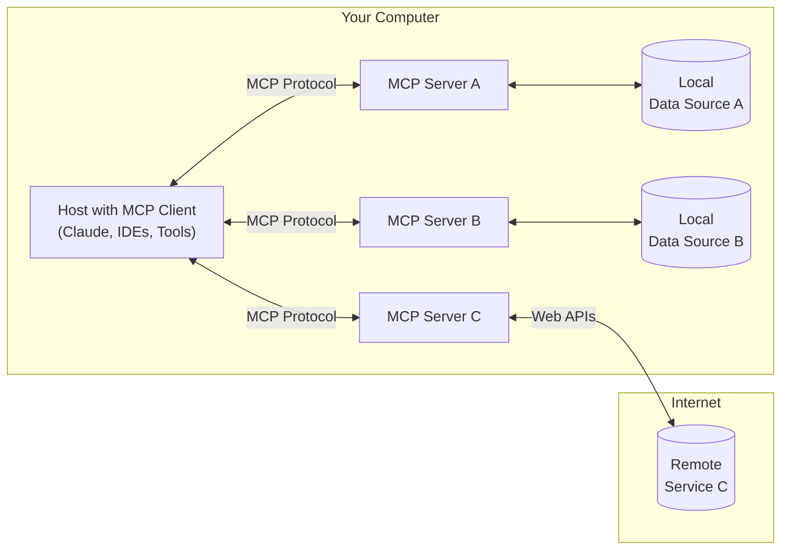

<Note>C# SDK 已发布！立即查看[最新动态](/development/updates)</Note>

MCP 是一个开放协议，旨在标准化应用程序为LLMs提供上下文的方式。您可以将MCP视为AI应用的USB-C接口——正如USB-C为设备连接外设提供了标准化方案，MCP则为AI模型对接各类数据源和工具提供了统一范式。

## 为什么选择MCP？
MCP帮助您在LLMs之上构建智能体和复杂工作流。当LLMs需要整合数据和工具时，MCP提供：

- 持续增长的预构建集成方案，实现LLM即插即用

- 灵活切换不同LLM服务商的自由选择

- 保障基础设施内数据安全的最佳实践

### 总体架构
MCP采用客户端-服务端架构，支持主程序连接多个服务端：
- **MCP Hosts**：如Claude Desktop、IDE等需要接入数据的AI工具

- **MCP Clients**：协议客户端，与服务端保持一对一连接

- **MCP Servers**：轻量化程序，通过标准化协议暴露特定能力

- **本地数据源**：计算机文件、数据库等MCP服务端可安全访问的资源
- **远程服务**：通过API等互联网协议连接的外部系统

## 快速开始
根据需求选择最佳路径：
#### 快速入门
<CardGroup cols={2}>
  <Card
    title="面向服务端开发者"
    icon="bolt"
    href="/quickstart/server"
  >
    构建自定义服务端并与Claude Desktop等客户端集成
  </Card>
  <Card
    title="面向客户端开发者"
    icon="bolt"
    href="/quickstart/client"
  >
    开发支持所有MCP服务端的客户端程序
  </Card>
  <Card
    title="面向Claude Desktop用户"
    icon="bolt"

    href="/quickstart/user"
  >
    在Claude Desktop中使用预构建服务端
  </Card>
</CardGroup>

#### 示例参考
<CardGroup cols={2}>
  <Card
    title="服务端示例"
    icon="grid"
    href="/examples"
  >
    查看官方MCP服务端实现案例库
  </Card>
  <Card
    title="客户端示例"

    icon="cubes"

    href="/clients"
  >
    获取支持MCP集成的客户端列表
  </Card>
</CardGroup>

## 教程指引
<CardGroup cols={2}>
  <Card
    title="结合LLM开发MCP应用"
    icon="comments"
    href="/tutorials/building-mcp-with-llms"
  >
    学习如何利用Claude等LLM加速MCP开发
  </Card>
  <Card
  title="调试指南"
  icon="bug"
  href="/docs/tools/debugging">
    掌握MCP服务端与集成的调试技巧
  </Card>
  <Card
    title="MCP检测工具"
    icon="magnifying-glass"
    href="/docs/tools/inspector"
  >
    使用交互式调试工具测试服务端
  </Card>
  <Card

    title="MCP实战工作坊（视频，2小时）"

    icon="person-chalkboard"

    href="https://www.youtube.com/watch?v=kQmXtrmQ5Zg"
  >
    <iframe src="https://www.youtube.com/embed/kQmXtrmQ5Zg"> </iframe>
  </Card>
</CardGroup>

## 深入探索
全面了解MCP核心概念与能力：
<CardGroup cols={2}>
  <Card
    title="核心架构"
    icon="sitemap"
    href="/docs/concepts/architecture"
  >
    解析MCP连接客户端、服务端与LLM的机制
  </Card>
  <Card
    title="资源体系"
    icon="database"
    href="/docs/concepts/resources"
  >
    通过服务端向LLM开放数据资源
  </Card>
  <Card
    title="提示工程"
    icon="message"
    href="/docs/concepts/prompts"
  >
    创建可复用的提示模板与工作流
  </Card>
  <Card
    title="工具集成"
    icon="wrench"
    href="/docs/concepts/tools"
  >
    赋能LLM通过服务端执行操作
  </Card>
  <Card
    title="采样机制"
    icon="robot"
    href="/docs/concepts/sampling"
  >
    允许服务端向LLM请求补全结果
  </Card>

  <Card

    title="传输协议"

    icon="network-wired"

    href="/docs/concepts/transports"

  >
    了解MCP的通信机制
  </Card>
</CardGroup>