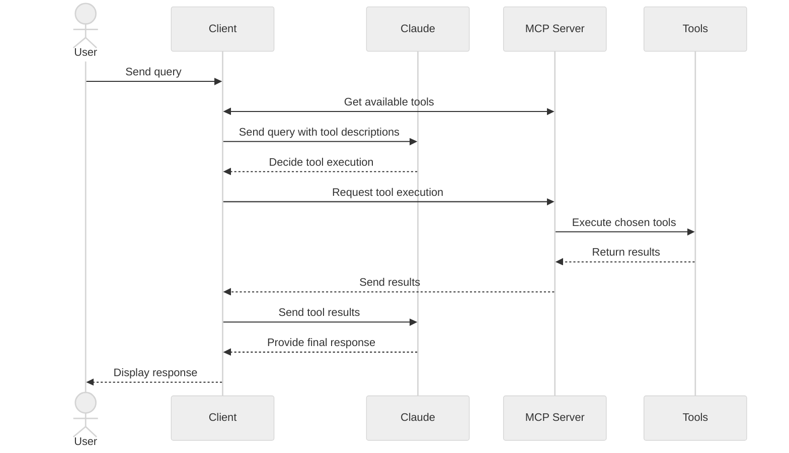

本教程将指导您构建一个基于大模型的聊天机器人客户端，该客户端可连接MCP服务端。建议先完成[服务端快速入门](/quickstart/server)教程，掌握基础服务端搭建知识。

```bash
# Create project directory
uv init mcp-client
cd mcp-client

# Create virtual environment
uv venv

# Activate virtual environment
# On Windows:
.venv\Scripts\activate
# On Unix or MacOS:
source .venv/bin/activate

# Install required packages
uv add mcp anthropic python-dotenv

# Remove boilerplate files
rm main.py

# Create our main file
touch client.py
```  
```bash
# Create .env file
touch .env
```  
```bash
ANTHROPIC_API_KEY=<your key here>
```  
```bash
echo ".env" >> .gitignore
```  
<Warning>
Make sure you keep your `ANTHROPIC_API_KEY` secure!
</Warning>  

## 创建客户端

### 基础客户端结构  
首先导入依赖并创建基础客户端类：  

```python
import asyncio
from typing import Optional
from contextlib import AsyncExitStack

from mcp import ClientSession, StdioServerParameters
from mcp.client.stdio import stdio_client

from anthropic import Anthropic
from dotenv import load_dotenv

load_dotenv()  # load environment variables from .env

class MCPClient:
    def __init__(self):
        # Initialize session and client objects
        self.session: Optional[ClientSession] = None
        self.exit_stack = AsyncExitStack()
        self.anthropic = Anthropic()
    # methods will go here
```  

### 服务端连接管理  
实现连接MCP服务端的方法：  

```python
async def connect_to_server(self, server_script_path: str):
    """Connect to an MCP server

    Args:
        server_script_path: Path to the server script (.py or .js)
    """
    is_python = server_script_path.endswith('.py')
    is_js = server_script_path.endswith('.js')
    if not (is_python or is_js):
        raise ValueError("Server script must be a .py or .js file")

    command = "python" if is_python else "node"
    server_params = StdioServerParameters(
        command=command,
        args=[server_script_path],
        env=None
    )

    stdio_transport = await self.exit_stack.enter_async_context(stdio_client(server_params))
    self.stdio, self.write = stdio_transport
    self.session = await self.exit_stack.enter_async_context(ClientSession(self.stdio, self.write))

    await self.session.initialize()

    # List available tools
    response = await self.session.list_tools()
    tools = response.tools
    print("\nConnected to server with tools:", [tool.name for tool in tools])
```  

### 查询处理逻辑  
添加核心功能处理查询与工具调用：  

```python
async def process_query(self, query: str) -> str:
    """Process a query using Claude and available tools"""
    messages = [
        {
            "role": "user",
            "content": query
        }
    ]

    response = await self.session.list_tools()
    available_tools = [{
        "name": tool.name,
        "description": tool.description,
        "input_schema": tool.inputSchema
    } for tool in response.tools]

    # Initial Claude API call
    response = self.anthropic.messages.create(
        model="claude-3-5-sonnet-20241022",
        max_tokens=1000,
        messages=messages,
        tools=available_tools
    )

    # Process response and handle tool calls
    final_text = []

    assistant_message_content = []
    for content in response.content:
        if content.type == 'text':
            final_text.append(content.text)
            assistant_message_content.append(content)
        elif content.type == 'tool_use':
            tool_name = content.name
            tool_args = content.input

            # Execute tool call
            result = await self.session.call_tool(tool_name, tool_args)
            final_text.append(f"[Calling tool {tool_name} with args {tool_args}]")

            assistant_message_content.append(content)
            messages.append({
                "role": "assistant",
                "content": assistant_message_content
            })
            messages.append({
                "role": "user",
                "content": [
                    {
                        "type": "tool_result",
                        "tool_use_id": content.id,
                        "content": result.content
                    }
                ]
            })

            # Get next response from Claude
            response = self.anthropic.messages.create(
                model="claude-3-5-sonnet-20241022",
                max_tokens=1000,
                messages=messages,
                tools=available_tools
            )

            final_text.append(response.content[0].text)

    return "\n".join(final_text)
```  

### 交互式聊天界面  
实现聊天循环与资源清理功能：  

```python
async def chat_loop(self):
    """Run an interactive chat loop"""
    print("\nMCP Client Started!")
    print("Type your queries or 'quit' to exit.")

    while True:
        try:
            query = input("\nQuery: ").strip()

            if query.lower() == 'quit':
                break

            response = await self.process_query(query)
            print("\n" + response)

        except Exception as e:
            print(f"\nError: {str(e)}")

async def cleanup(self):
    """Clean up resources"""
    await self.exit_stack.aclose()
```  

### 主入口  
添加主执行逻辑：  

```python
async def main():
    if len(sys.argv) < 2:
        print("Usage: python client.py <path_to_server_script>")
        sys.exit(1)

    client = MCPClient()
    try:
        await client.connect_to_server(sys.argv[1])
        await client.chat_loop()
    finally:
        await client.cleanup()

if __name__ == "__main__":
    import sys
    asyncio.run(main())
```  

完整`client.py`文件可[在此获取](https://gist.github.com/zckly/f3f28ea731e096e53b39b47bf0a2d4b1)  

## 核心组件解析  

### 1. 客户端初始化  
- `MCPClient`类初始化会话管理与API客户端  
- 使用`AsyncExitStack`实现资源管理  
- 配置Anthropic客户端用于Claude交互  

### 2. 服务端连接  
- 支持Python与Node.js服务端  
- 验证服务端脚本类型  
- 建立通信通道  
- 初始化会话并列出可用工具  

### 3. 查询处理  
- 维护对话上下文  
- 处理Claude响应与工具调用  
- 管理Claude与工具间的消息流  
- 整合结果生成连贯响应  

### 4. 交互界面  
- 提供简洁命令行界面  
- 处理用户输入与响应展示  
- 基础错误处理机制  
- 支持优雅退出  

### 5. 资源管理  
- 规范资源清理流程  
- 连接问题错误处理  
- 优雅关闭机制  

## 常见定制点  

1. **工具处理**  
   - 修改`process_query()`处理特定工具类型  
   - 添加工具调用错误处理  
   - 实现工具专属响应格式化  

2. **响应处理**  
   - 自定义工具结果格式化方式  
   - 添加响应过滤或转换逻辑  
   - 实现定制日志记录  

3. **用户界面**  
   - 添加GUI或网页界面  
   - 实现富文本控制台输出  
   - 添加命令历史与自动补全  

## 运行客户端  

连接任意MCP服务端：  

```bash
uv run client.py path/to/server.py # python server
uv run client.py path/to/build/index.js # node server
```  

<Note>
If you're continuing the weather tutorial from the server quickstart, your command might look something like this: `python client.py .../quickstart-resources/weather-server-python/weather.py`
</Note>  

客户端将执行：  
1. 连接指定服务端  
2. 列出可用工具  
3. 启动交互会话支持：  
   - 输入查询  
   - 查看工具执行  
   - 获取Claude响应  

连接天气服务端时的运行示例（参见服务端快速入门）：  

<Frame>
  
</Frame>  

## 工作原理  

查询处理流程：  
1. 客户端从服务端获取工具列表  
2. 查询与工具描述发送至Claude  
3. Claude决策是否调用工具  
4. 客户端通过服务端执行工具调用  
5. 结果返回Claude  
6. Claude生成自然语言响应  
7. 向用户展示响应  

## 最佳实践  

1. **错误处理**  
   - 工具调用需包裹try-catch块  
   - 提供明确错误信息  
   - 妥善处理连接问题  

2. **资源管理**  
   - 使用`AsyncExitStack`确保资源清理  
   - 完成后关闭连接  
   - 处理服务端断开情况  

3. **安全性**  
   - API密钥存储在`.env`  
   - 验证服务端响应  
   - 谨慎设置工具权限  

## 故障排查  

### 服务端路径问题  
- 确认脚本路径正确  
- 相对路径无效时使用绝对路径  
- Windows用户需使用正斜杠(/)或转义反斜杠(\\)  
- 验证脚本扩展名正确（.py对应Python/.js对应Node.js）  

正确路径示例：  
```bash
# Relative path
uv run client.py ./server/weather.py

# Absolute path
uv run client.py /Users/username/projects/mcp-server/weather.py

# Windows path (either format works)
uv run client.py C:/projects/mcp-server/weather.py
uv run client.py C:\\projects\\mcp-server\\weather.py
```  

### 响应延迟  
- 首次响应可能需30秒  
- 此过程包含：  
  - 服务端初始化  
  - Claude处理查询  
  - 工具执行  
- 后续响应通常更快  
- 初始等待期间请勿中断  

### 常见错误  

若出现：  
- `FileNotFoundError`：检查服务端路径  
- `Connection refused`：确认服务端运行且路径正确  
- `Tool execution failed`：验证工具所需环境变量  
- `Timeout error`：考虑增加客户端超时设置  


```bash MacOS/Linux
# Create project directory
mkdir mcp-client-typescript
cd mcp-client-typescript

# Initialize npm project
npm init -y

# Install dependencies
npm install @anthropic-ai/sdk @modelcontextprotocol/sdk dotenv

# Install dev dependencies
npm install -D @types/node typescript

# Create source file
touch index.ts
```  
```powershell Windows
# Create project directory
md mcp-client-typescript
cd mcp-client-typescript

# Initialize npm project
npm init -y

# Install dependencies
npm install @anthropic-ai/sdk @modelcontextprotocol/sdk dotenv

# Install dev dependencies
npm install -D @types/node typescript

# Create source file
new-item index.ts
```  
<CodeGroup>

</CodeGroup>  

更新`package.json`设置`type: "module"`与构建脚本：  

```json package.json
{
  "type": "module",
  "scripts": {
    "build": "tsc && chmod 755 build/index.js"
  }
}
```  

在项目根目录创建`tsconfig.json`：  

```json tsconfig.json
{
  "compilerOptions": {
    "target": "ES2022",
    "module": "Node16",
    "moduleResolution": "Node16",
    "outDir": "./build",
    "rootDir": "./",
    "strict": true,
    "esModuleInterop": true,
    "skipLibCheck": true,
    "forceConsistentCasingInFileNames": true
  },
  "include": ["index.ts"],
  "exclude": ["node_modules"]
}
```  

## 配置API密钥  

需从[Anthropic控制台](https://console.anthropic.com/settings/keys)获取API密钥。  

创建`.env`文件存储密钥：  

```bash
echo "ANTHROPIC_API_KEY=<your key here>" > .env
```  

将`.env`添加至`.gitignore`：  
```bash
echo ".env" >> .gitignore
```  

<Warning>
Make sure you keep your `ANTHROPIC_API_KEY` secure!
</Warning>  

## 创建客户端  

### 基础结构  
在`index.ts`中设置依赖与基础类：  

```typescript
import { Anthropic } from "@anthropic-ai/sdk";
import {
  MessageParam,
  Tool,
} from "@anthropic-ai/sdk/resources/messages/messages.mjs";
import { Client } from "@modelcontextprotocol/sdk/client/index.js";
import { StdioClientTransport } from "@modelcontextprotocol/sdk/client/stdio.js";
import readline from "readline/promises";
import dotenv from "dotenv";

dotenv.config();

const ANTHROPIC_API_KEY = process.env.ANTHROPIC_API_KEY;
if (!ANTHROPIC_API_KEY) {
  throw new Error("ANTHROPIC_API_KEY is not set");
}

class MCPClient {
  private mcp: Client;
  private anthropic: Anthropic;
  private transport: StdioClientTransport | null = null;
  private tools: Tool[] = [];

  constructor() {
    this.anthropic = new Anthropic({
      apiKey: ANTHROPIC_API_KEY,
    });
    this.mcp = new Client({ name: "mcp-client-cli", version: "1.0.0" });
  }
  // methods will go here
}
```  

### 服务端连接  
实现MCP服务端连接方法：  

```typescript
async connectToServer(serverScriptPath: string) {
  try {
    const isJs = serverScriptPath.endsWith(".js");
    const isPy = serverScriptPath.endsWith(".py");
    if (!isJs && !isPy) {
      throw new Error("Server script must be a .js or .py file");
    }
    const command = isPy
      ? process.platform === "win32"
        ? "python"
        : "python3"
      : process.execPath;
    
    this.transport = new StdioClientTransport({
      command,
      args: [serverScriptPath],
    });
    this.mcp.connect(this.transport);
    
    const toolsResult = await this.mcp.listTools();
    this.tools = toolsResult.tools.map((tool) => {
      return {
        name: tool.name,
        description: tool.description,
        input_schema: tool.inputSchema,
      };
    });
    console.log(
      "Connected to server with tools:",
      this.tools.map(({ name }) => name)
    );
  } catch (e) {
    console.log("Failed to connect to MCP server: ", e);
    throw e;
  }
}
```  

### 查询处理  
添加核心查询与工具调用逻辑：  

```typescript
async processQuery(query: string) {
  const messages: MessageParam[] = [
    {
      role: "user",
      content: query,
    },
  ];

  const response = await this.anthropic.messages.create({
    model: "claude-3-5-sonnet-20241022",
    max_tokens: 1000,
    messages,
    tools: this.tools,
  });

  const finalText = [];
  const toolResults = [];

  for (const content of response.content) {
    if (content.type === "text") {
      finalText.push(content.text);
    } else if (content.type === "tool_use") {
      const toolName = content.name;
      const toolArgs = content.input as { [x: string]: unknown } | undefined;

      const result = await this.mcp.callTool({
        name: toolName,
        arguments: toolArgs,
      });
      toolResults.push(result);
      finalText.push(
        `[Calling tool ${toolName} with args ${JSON.stringify(toolArgs)}]`
      );

      messages.push({
        role: "user",
        content: result.content as string,
      });

      const response = await this.anthropic.messages.create({
        model: "claude-3-5-sonnet-20241022",
        max_tokens: 1000,
        messages,
      });

      finalText.push(
        response.content[0].type === "text" ? response.content[0].text : ""
      );
    }
  }

  return finalText.join("\n");
}
```  

### 交互界面  
实现聊天循环与清理功能：  

```typescript
async chatLoop() {
  const rl = readline.createInterface({
    input: process.stdin,
    output: process.stdout,
  });

  try {
    console.log("\nMCP Client Started!");
    console.log("Type your queries or 'quit' to exit.");

    while (true) {
      const message = await rl.question("\nQuery: ");
      if (message.toLowerCase() === "quit") {
        break;
      }
      const response = await this.processQuery(message);
      console.log("\n" + response);
    }
  } finally {
    rl.close();
  }
}

async cleanup() {
  await this.mcp.close();
}
```  

### 主入口  
添加主执行逻辑：  

```typescript
async function main() {
  if (process.argv.length < 3) {
    console.log("Usage: node index.ts <path_to_server_script>");
    return;
  }
  const mcpClient = new MCPClient();
  try {
    await mcpClient.connectToServer(process.argv[2]);
    await mcpClient.chatLoop();
  } finally {
    await mcpClient.cleanup();
    process.exit(0);
  }
}

main();
```  

## 运行客户端  

连接任意MCP服务端：  

```bash
# Build TypeScript
npm run build

# Run the client
node build/index.js path/to/server.py # python server
node build/index.js path/to/build/index.js # node server
```  

<Note>
If you're continuing the weather tutorial from the server quickstart, your command might look something like this: `node build/index.js .../quickstart-resources/weather-server-typescript/build/index.js`
</Note>  

**客户端将：**  
1. 连接指定服务端  
2. 列出可用工具  
3. 启动交互会话支持：  
   - 输入查询  
   - 查看工具执行  
   - 获取Claude响应  

## 工作原理  

查询处理流程：  
1. 客户端获取服务端工具列表  
2. 查询与工具描述发送至Claude  
3. Claude决策工具调用  
4. 客户端通过服务端执行工具  
5. 结果返回Claude  
6. Claude生成自然响应  
7. 向用户展示结果  

## 最佳实践  

1. **错误处理**  
   - 利用TypeScript类型系统检测错误  
   - 工具调用包裹try-catch块  
   - 提供明确错误信息  
   - 妥善处理连接问题  

2. **安全性**  
   - API密钥存储在`.env`  
   - 验证服务端响应  
   - 谨慎设置工具权限  

## 故障排查  

### 服务端路径问题  
- 确认脚本路径正确  
- 相对路径无效时使用绝对路径  
- Windows用户需使用正斜杠(/)或转义反斜杠(\\)  
- 验证脚本扩展名正确（.js对应Node.js/.py对应Python）  

正确路径示例：  
```bash
# Relative path
node build/index.js ./server/build/index.js

# Absolute path
node build/index.js /Users/username/projects/mcp-server/build/index.js

# Windows path (either format works)
node build/index.js C:/projects/mcp-server/build/index.js
node build/index.js C:\\projects\\mcp-server\\build\\index.js
```  

### 响应延迟  
- 首次响应可能需30秒  
- 此过程包含：  
  - 服务端初始化  
  - Claude处理查询  
  - 工具执行  
- 后续响应通常更快  
- 初始等待期间请勿中断  

### 常见错误  

若出现：  
- `Error: Cannot find module`：检查构建文件夹与TypeScript编译  
- `Connection refused`：确认服务端运行且路径正确  
- `Tool execution failed`：验证工具所需环境变量  
- `ANTHROPIC_API_KEY is not set`：检查.env文件与环境变量  
- `TypeError`：确认工具参数类型正确  

<Note>
This is a quickstart demo based on Spring AI MCP auto-configuration and boot starters.
To learn how to create sync and async MCP Clients manually, consult the [Java SDK Client](/sdk/java/mcp-client) documentation
</Note>  

本示例演示如何结合Spring AI的模型上下文协议(MCP)与[Brave搜索MCP服务端](https://github.com/modelcontextprotocol/servers/tree/main/src/brave-search)构建交互式聊天机器人。该应用通过Anthropic的Claude大模型创建对话界面，支持通过Brave搜索实时获取网络数据。  
[完整代码见此](https://github.com/spring-projects/spring-ai-examples/tree/main/model-context-protocol/web-search/brave-chatbot)  

## 系统要求  

- Java 17+  
- Maven 3.6+  
- npx包管理器  
- Anthropic API密钥(Claude)  
- Brave搜索API密钥  

## 环境配置  

1. 安装npx：  
   ```bash  
   npm install -g npx  
   ```  

2. 克隆仓库：  
   ```bash  
   git clone https://github.com/spring-projects/spring-ai-examples.git  
   cd model-context-protocol/brave-chatbot  
   ```  

3. 设置API密钥：  
   ```bash  
   export ANTHROPIC_API_KEY='your-key'  
   export BRAVE_API_KEY='your-key'  
   ```  

4. 构建应用：  
   ```bash  
   ./mvnw clean install  
   ```  

5. 运行应用：  
   ```bash  
   ./mvnw spring-boot:run  
   ```  

<Warning>
Make sure you keep your `ANTHROPIC_API_KEY` and `BRAVE_API_KEY` keys secure!
</Warning>  

## 实现原理  

应用通过以下组件集成Spring AI与Brave搜索MCP服务端：  

### MCP客户端配置  

1. pom.xml依赖：  
```xml
<dependency>
    <groupId>org.springframework.ai</groupId>
    <artifactId>spring-ai-starter-mcp-client</artifactId>
</dependency>
<dependency>
    <groupId>org.springframework.ai</groupId>
    <artifactId>spring-ai-starter-model-anthropic</artifactId>
</dependency>
```  

2. 应用属性(application.yml)：  
```yml
spring:
  ai:
    mcp:
      client:
        enabled: true
        name: brave-search-client
        version: 1.0.0
        type: SYNC
        request-timeout: 20s
        stdio:
          root-change-notification: true
          servers-configuration: classpath:/mcp-servers-config.json
        toolcallback:
          enabled: true
    anthropic:
      api-key: ${ANTHROPIC_API_KEY}
```  

激活`spring-ai-starter-mcp-client`以根据配置创建`McpClient`实例。  
`spring.ai.mcp.client.toolcallback.enabled=true`属性启用工具回调机制，自动注册所有MCP工具为Spring AI工具（默认禁用）。  

3. MCP服务端配置(`mcp-servers-config.json`)：  
```json
{
  "mcpServers": {
    "brave-search": {
      "command": "npx",
      "args": [
        "-y",
        "@modelcontextprotocol/server-brave-search"
      ],
      "env": {
        "BRAVE_API_KEY": "<PUT YOUR BRAVE API KEY>"
      }
    }
  }
}
```  

### 聊天实现  

使用Spring AI的ChatClient集成MCP工具：  

```java
var chatClient = chatClientBuilder
    .defaultSystem("You are useful assistant, expert in AI and Java.")
    .defaultTools((Object[]) mcpToolAdapter.toolCallbacks())
    .defaultAdvisors(new MessageChatMemoryAdvisor(new InMemoryChatMemory()))
    .build();
```  

核心特性：  
- 采用Claude大模型处理自然语言  
- 通过MCP集成Brave实时搜索  
- 使用InMemoryChatMemory维护会话记忆  
- 作为命令行交互应用运行  

### 构建运行  

```bash
./mvnw clean install
java -jar ./target/ai-mcp-brave-chatbot-0.0.1-SNAPSHOT.jar
```  

或  

```bash
./mvnw spring-boot:run
```  

启动后可通过交互会话：  
- 使用内置知识回答问题  
- 需要时通过Brave执行网络搜索  
- 记忆上下文信息  
- 综合多源信息生成回答  

### 高级配置  

MCP客户端支持：  
- 通过`McpSyncClientCustomizer`或`McpAsyncClientCustomizer`定制客户端  
- 多传输类型：`STDIO`与`SSE`(服务器推送事件)  
- 集成Spring AI工具执行框架  
- 自动客户端初始化与生命周期管理  

WebFlux应用可使用：  

```xml
<dependency>
    <groupId>org.springframework.ai</groupId>
    <artifactId>spring-ai-mcp-client-webflux-spring-boot-starter</artifactId>
</dependency>
```  

提供相似功能但采用WebFlux-based SSE传输实现，推荐生产环境使用。  


```bash
java --version
```  
```bash MacOS/Linux
# Create a new directory for our project
mkdir kotlin-mcp-client
cd kotlin-mcp-client

# Initialize a new kotlin project
gradle init
```  
```powershell Windows
# Create a new directory for our project
md kotlin-mcp-client
cd kotlin-mcp-client
# Initialize a new kotlin project
gradle init
```  
<CodeGroup>

</CodeGroup>  

运行`gradle init`后选择：  
**Application**项目类型，**Kotlin**语言，**Java 17**版本。  

或通过[IntelliJ向导](https://kotlinlang.org/docs/jvm-get-started.html)创建项目后添加依赖：  

```kotlin build.gradle.kts
val mcpVersion = "0.4.0"
val slf4jVersion = "2.0.9"
val anthropicVersion = "0.8.0"

dependencies {
    implementation("io.modelcontextprotocol:kotlin-sdk:$mcpVersion")
    implementation("org.slf4j:slf4j-nop:$slf4jVersion")
    implementation("com.anthropic:anthropic-java:$anthropicVersion")
}
```  
```groovy build.gradle
def mcpVersion = '0.3.0'
def slf4jVersion = '2.0.9'
def anthropicVersion = '0.8.0'
dependencies {
    implementation "io.modelcontextprotocol:kotlin-sdk:$mcpVersion"
    implementation "org.slf4j:slf4j-nop:$slf4jVersion"
    implementation "com.anthropic:anthropic-java:$anthropicVersion"
}
```  
<CodeGroup>

</CodeGroup>  

构建脚本添加插件：  
```kotlin build.gradle.kts
plugins {
    id("com.github.johnrengelman.shadow") version "8.1.1"
}
```  
```groovy build.gradle
plugins {
    id 'com.github.johnrengelman.shadow' version '8.1.1'
}
```  
<CodeGroup>

</CodeGroup>  

## API密钥配置  

从[Anthropic控制台](https://console.anthropic.com/settings/keys)获取密钥后设置：  

```bash
export ANTHROPIC_API_KEY='your-anthropic-api-key-here'
```  

<Warning>
Make sure your keep your `ANTHROPIC_API_KEY` secure!
</Warning>  

## 创建客户端  

### 基础结构  
创建基础客户端类：  

```kotlin
class MCPClient : AutoCloseable {
    private val anthropic = AnthropicOkHttpClient.fromEnv()
    private val mcp: Client = Client(clientInfo = Implementation(name = "mcp-client-cli", version = "1.0.0"))
    private lateinit var tools: List<ToolUnion>

    // methods will go here

    override fun close() {
        runBlocking {
            mcp.close()
            anthropic.close()
        }
    }
```  

### 服务端连接  
实现MCP服务端连接方法：  

```kotlin
suspend fun connectToServer(serverScriptPath: String) {
    try {
        val command = buildList {
            when (serverScriptPath.substringAfterLast(".")) {
                "js" -> add("node")
                "py" -> add(if (System.getProperty("os.name").lowercase().contains("win")) "python" else "python3")
                "jar" -> addAll(listOf("java", "-jar"))
                else -> throw IllegalArgumentException("Server script must be a .js, .py or .jar file")
            }
            add(serverScriptPath)
        }

        val process = ProcessBuilder(command).start()
        val transport = StdioClientTransport(
            input = process.inputStream.asSource().buffered(),
            output = process.outputStream.asSink().buffered()
        )

        mcp.connect(transport)

        val toolsResult = mcp.listTools()
        tools = toolsResult?.tools?.map { tool ->
            ToolUnion.ofTool(
                Tool.builder()
                    .name(tool.name)
                    .description(tool.description ?: "")
                    .inputSchema(
                        Tool.InputSchema.builder()
                            .type(JsonValue.from(tool.inputSchema.type))
                            .properties(tool.inputSchema.properties.toJsonValue())
                            .putAdditionalProperty("required", JsonValue.from(tool.inputSchema.required))
                            .build()
                    )
                    .build()
            )
        } ?: emptyList()
        println("Connected to server with tools: ${tools.joinToString(", ") { it.tool().get().name() }}")
    } catch (e: Exception) {
        println("Failed to connect to MCP server: $e")
        throw e
    }
}
```  

创建`JsonObject`转`JsonValue`的辅助函数：  
```kotlin
private fun JsonObject.toJsonValue(): JsonValue {
    val mapper = ObjectMapper()
    val node = mapper.readTree(this.toString())
    return JsonValue.fromJsonNode(node)
}
```  

### 查询处理  
添加核心查询与工具调用逻辑：  

```kotlin
private val messageParamsBuilder: MessageCreateParams.Builder = MessageCreateParams.builder()
    .model(Model.CLAUDE_3_5_SONNET_20241022)
    .maxTokens(1024)

suspend fun processQuery(query: String): String {
    val messages = mutableListOf(
        MessageParam.builder()
            .role(MessageParam.Role.USER)
            .content(query)
            .build()
    )

    val response = anthropic.messages().create(
        messageParamsBuilder
            .messages(messages)
            .tools(tools)
            .build()
    )

    val finalText = mutableListOf<String>()
    response.content().forEach { content ->
        when {
            content.isText() -> finalText.add(content.text().getOrNull()?.text() ?: "")

            content.isToolUse() -> {
                val toolName = content.toolUse().get().name()
                val toolArgs =
                    content.toolUse().get()._input().convert(object : TypeReference<Map<String, JsonValue>>() {})

                val result = mcp.callTool(
                    name = toolName,
                    arguments = toolArgs ?: emptyMap()
                )
                finalText.add("[Calling tool $toolName with args $toolArgs]")

                messages.add(
                    MessageParam.builder()
                        .role(MessageParam.Role.USER)
                        .content(
                            """
                                "type": "tool_result",
                                "tool_name": $toolName,
                                "result": ${result?.content?.joinToString("\n") { (it as TextContent).text ?: "" }}
                            """.trimIndent()
                        )
                        .build()
                )

                val aiResponse = anthropic.messages().create(
                    messageParamsBuilder
                        .messages(messages)
                        .build()
                )

                finalText.add(aiResponse.content().first().text().getOrNull()?.text() ?: "")
            }
        }
    }

    return finalText.joinToString("\n", prefix = "", postfix = "")
}
```  

### 交互聊天  
实现聊天循环：  

```kotlin
suspend fun chatLoop() {
    println("\nMCP Client Started!")
    println("Type your queries or 'quit' to exit.")

    while (true) {
        print("\nQuery: ")
        val message = readLine() ?: break
        if (message.lowercase() == "quit") break
        val response = processQuery(message)
        println("\n$response")
    }
}
```  

### 主入口  
添加主执行函数：  

```kotlin
fun main(args: Array<String>) = runBlocking {
    if (args.isEmpty()) throw IllegalArgumentException("Usage: java -jar <your_path>/build/libs/kotlin-mcp-client-0.1.0-all.jar <path_to_server_script>")
    val serverPath = args.first()
    val client = MCPClient()
    client.use {
        client.connectToServer(serverPath)
        client.chatLoop()
    }
}
```  

## 运行客户端  

连接任意MCP服务端：  

```bash
./gradlew build

# Run the client
java -jar build/libs/<your-jar-name>.jar path/to/server.jar # jvm server
java -jar build/libs/<your-jar-name>.jar path/to/server.py # python server
java -jar build/libs/<your-jar-name>.jar path/to/build/index.js # node server
```  

<Note>
If you're continuing the weather tutorial from the server quickstart, your command might look something like this: `java -jar build/libs/kotlin-mcp-client-0.1.0-all.jar .../samples/weather-stdio-server/build/libs/weather-stdio-server-0.1.0-all.jar`
</Note>  

**客户端将：**  
1. 连接指定服务端  
2. 列出可用工具  
3. 启动交互会话支持：  
   - 输入查询  
   - 查看工具执行  
   - 获取Claude响应  

## 工作原理  

高层工作流示意图：  



查询处理流程：  
1. 客户端获取服务端工具列表  
2. 查询与工具描述发送至Claude  
3. Claude决策工具调用  
4. 客户端通过服务端执行工具  
5. 结果返回Claude  
6. Claude生成自然响应  
7. 向用户展示结果  

## 最佳实践  

1. **错误处理**  
   - 利用Kotlin类型系统显式建模错误  
   - 可能异常的外部调用包裹`try-catch`块  
   - 提供清晰错误信息  
   - 优雅处理网络超时  

2. **安全性**  
   - 密钥存储在`local.properties`/环境变量/密钥管理器  
   - 验证外部响应数据  
   - 谨慎设置工具权限  

## 故障排查  

### 服务端路径问题  
- 确认脚本路径正确  
- 相对路径无效时使用绝对路径  
- Windows用户需使用正斜杠(/)或转义反斜杠(\\)  
- 确保已安装所需运行时（Java/npm/uv）  
- 验证脚本扩展名正确（.jar/.js/.py）  

正确路径示例：  
```bash
# Relative path
java -jar build/libs/client.jar ./server/build/libs/server.jar

# Absolute path
java -jar build/libs/client.jar /Users/username/projects/mcp-server/build/libs/server.jar

# Windows path (either format works)
java -jar build/libs/client.jar C:/projects/mcp-server/build/libs/server.jar
java -jar build/libs/client.jar C:\\projects\\mcp-server\\build\\libs\\server.jar
```  

### 响应延迟  
- 首次响应可能需30秒  
- 此过程包含：  
  - 服务端初始化  
  - Claude处理查询  
  - 工具执行  
- 后续响应通常更快  
- 初始等待期间请勿中断  

### 常见错误  

若出现：  
- `Connection refused`：确认服务端运行且路径正确  
- `Tool execution failed`：验证工具所需环境变量  
- `ANTHROPIC_API_KEY is not set`：检查环境变量  


```bash
dotnet new console -n QuickstartClient
cd QuickstartClient
```  
```bash
dotnet add package ModelContextProtocol --prerelease
dotnet add package Anthropic.SDK
dotnet add package Microsoft.Extensions.Hosting
```  
```bash
dotnet user-secrets init
dotnet user-secrets set "ANTHROPIC_API_KEY" "<your key here>"
```  
```csharp
using Microsoft.Extensions.Configuration;
using Microsoft.Extensions.Hosting;

var builder = Host.CreateEmptyApplicationBuilder(settings: null);

builder.Configuration
    .AddUserSecrets<Program>();
```  
```csharp
var (command, arguments) = args switch
{
    [var script] when script.EndsWith(".py") => ("python", script),
    [var script] when script.EndsWith(".js") => ("node", script),
    [var script] when Directory.Exists(script) || (File.Exists(script) && script.EndsWith(".csproj")) => ("dotnet", $"run --project {script} --no-build"),
    _ => throw new NotSupportedException("An unsupported server script was provided. Supported scripts are .py, .js, or .csproj")
};

await using var mcpClient = await McpClientFactory.CreateAsync(new()
{
    Id = "demo-server",
    Name = "Demo Server",
    TransportType = TransportTypes.StdIo,
    TransportOptions = new()
    {
        ["command"] = command,
        ["arguments"] = arguments,
    }
});

var tools = await mcpClient.ListToolsAsync();
foreach (var tool in tools)
{
    Console.WriteLine($"Connected to server with tools: {tool.Name}");
}
```  
```csharp
using ModelContextProtocol.Client;
using ModelContextProtocol.Protocol.Transport;
```  
<Note>
Be sure to add the `using` statements for the namespaces:
</Note>  

该配置创建可通过命令行参数连接服务端的MCP客户端，并列出可用工具。  

### 查询处理  
添加核心查询与工具调用逻辑：  

```csharp
using IChatClient anthropicClient = new AnthropicClient(new APIAuthentication(builder.Configuration["ANTHROPIC_API_KEY"]))
    .Messages
    .AsBuilder()
    .UseFunctionInvocation()
    .Build();

var options = new ChatOptions
{
    MaxOutputTokens = 1000,
    ModelId = "claude-3-5-sonnet-20241022",
    Tools = [.. tools]
};

while (true)
{
    Console.WriteLine("MCP Client Started!");
    Console.WriteLine("Type your queries or 'quit' to exit.");

    string? query = Console.ReadLine();

    if (string.IsNullOrWhiteSpace(query))
    {
        continue;
    }
    if (string.Equals(query, "quit", StringComparison.OrdinalIgnoreCase))
    {
        break;
    }

    var response = anthropicClient.GetStreamingResponseAsync(query, options);

    await foreach (var message in response)
    {
        Console.Write(message.Text);
    }
    Console.WriteLine();
}
```  

## 核心组件  

### 1. 客户端初始化  
* 使用`McpClientFactory.CreateAsync()`初始化客户端，配置传输类型与服务端运行命令  

### 2. 服务端连接  
* 支持Python/Node.js/.NET服务端  
* 通过参数命令启动服务端  
* 配置stdio与服务端通信  
* 初始化会话与工具列表  

### 3. 查询处理  
* 采用[Microsoft.Extensions.AI](https://learn.microsoft.com/dotnet/ai/ai-extensions)实现聊天客户端  
* 配置`IChatClient`实现自动工具调用  
* 客户端读取用户输入并发送至服务端  
* 服务端处理查询返回响应  
* 向用户展示响应  

### 运行客户端  
连接任意MCP服务端：  
```bash
dotnet run -- path/to/server.csproj # dotnet server
dotnet run -- path/to/server.py # python server
dotnet run -- path/to/server.js # node server
```  
<Note>
If you're continuing the weather tutorial from the server quickstart, your command might look something like this: `dotnet run -- path/to/QuickstartWeatherServer`.
</Note>  

客户端将：  
1. 连接指定服务端  
2. 列出可用工具  
3. 启动交互会话支持：  
   - 输入查询  
   - 查看工具执行  
   - 获取Claude响应  
4. 完成后退出会话  

连接天气服务端时的运行示例：  

<Frame>
  
</Frame>  

## 后续步骤  
<CardGroup>
  <Card
    title="Example servers"
    icon="grid"
    href="/examples"
  >
    Check out our gallery of official MCP servers and implementations
  </Card>  
  <Card
    title="Clients"
    icon="cubes"
    href="/clients"
  >
    View the list of clients that support MCP integrations
  </Card>  
  <Card
    title="Building MCP with LLMs"
    icon="comments"
    href="/tutorials/building-mcp-with-llms"
  >
    Learn how to use LLMs like Claude to speed up your MCP development
  </Card>  
   <Card
    title="Core architecture"
    icon="sitemap"
    href="/docs/concepts/architecture"
  >
    Understand how MCP connects clients, servers, and LLMs
  </Card>  
</CardGroup>