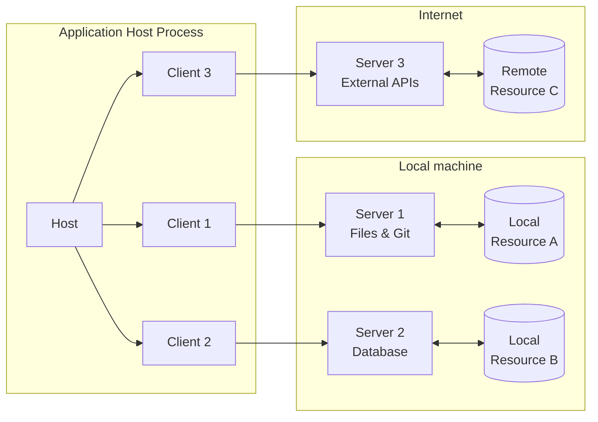
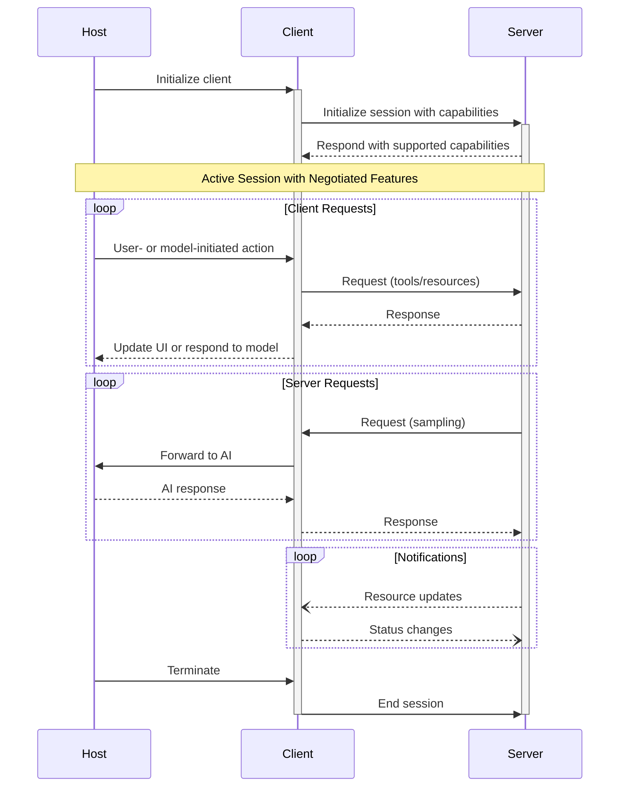

模型上下文协议（MCP）采用客户端-宿主-服务端架构，每个宿主进程可运行多个客户端实例。该架构使用户能在不同应用中集成AI能力，同时保持明确的安全边界与关注点隔离。基于JSON-RPC构建的MCP提供有状态会话协议，专注于客户端与服务端之间的上下文交换和采样协调。

## 核心组件

### 宿主

宿主进程作为容器和协调者：

- 创建并管理多个客户端实例
- 控制客户端连接权限与生命周期
- 强制执行安全策略和授权要求
- 处理用户授权决策
- 协调AI/大模型集成与采样
- 管理跨客户端的上下文聚合

### 客户端

每个由宿主创建的客户端维护独立的服务端连接：

- 为每个服务端建立单一有状态会话
- 处理协议协商与能力交换
- 双向路由协议消息
- 管理订阅与通知
- 维护服务端间的安全边界

宿主应用创建并管理多个客户端，每个客户端与特定服务端保持1:1对应关系。

### 服务端

服务端提供专业化的上下文与能力：

- 通过MCP原语暴露资源、工具和提示词
- 以专注职责独立运行
- 通过客户端接口请求采样
- 必须遵守安全约束
- 可以是本地进程或远程服务

## 设计原则

MCP基于以下关键设计原则构建，这些原则指导着其架构与实现：

1. **服务端应极简构建**

   - 宿主应用处理复杂编排职责
   - 服务端聚焦特定、定义明确的能力
   - 简洁接口最小化实现开销
   - 清晰分离确保可维护代码

2. **服务端应高度可组合**

   - 每个服务端独立提供专注功能
   - 多个服务端可无缝组合
   - 共享协议实现互操作性
   - 模块化设计支持可扩展性

3. **服务端不应读取完整对话，也不能"窥探"其他服务端**

   - 服务端仅接收必要上下文信息
   - 完整对话历史保留在宿主端
   - 每个服务端连接保持隔离
   - 跨服务端交互由宿主控制
   - 宿主进程强制执行安全边界

4. **功能可渐进式添加到服务端与客户端**
   - 核心协议提供最小必要功能
   - 额外能力按需协商添加
   - 服务端与客户端独立演进
   - 协议设计支持未来扩展
   - 保持向后兼容性

## 消息类型

MCP基于[JSON-RPC 2.0](https://www.jsonrpc.org/specification)定义三种核心消息类型：

- **请求**：包含方法和参数的双向消息，期待响应
- **响应**：匹配特定请求ID的成功结果或错误
- **通知**：无需响应的单向消息

每种消息类型均遵循JSON-RPC 2.0规范的结构与传递语义。

## 能力协商

模型上下文协议采用基于能力的协商系统，客户端与服务端在初始化时显式声明其支持的功能。能力决定会话期间可用的协议功能和原语。

- 服务端声明能力如资源订阅、工具支持和提示词模板
- 客户端声明能力如采样支持和通知处理
- 双方必须在整个会话期间遵守已声明能力
- 额外能力可通过协议扩展进行协商

每项能力解锁会话期间可用的特定协议功能。例如：

- 已实现的[服务端功能](/specification/2024-11-05/server)必须在服务端能力中声明
- 发送资源订阅通知要求服务端声明订阅支持
- 工具调用要求服务端声明工具能力
- [采样](/specification/2024-11-05/client)功能要求客户端在能力中声明支持

这种能力协商机制确保客户端与服务端对支持功能有清晰认知，同时保持协议的可扩展性。