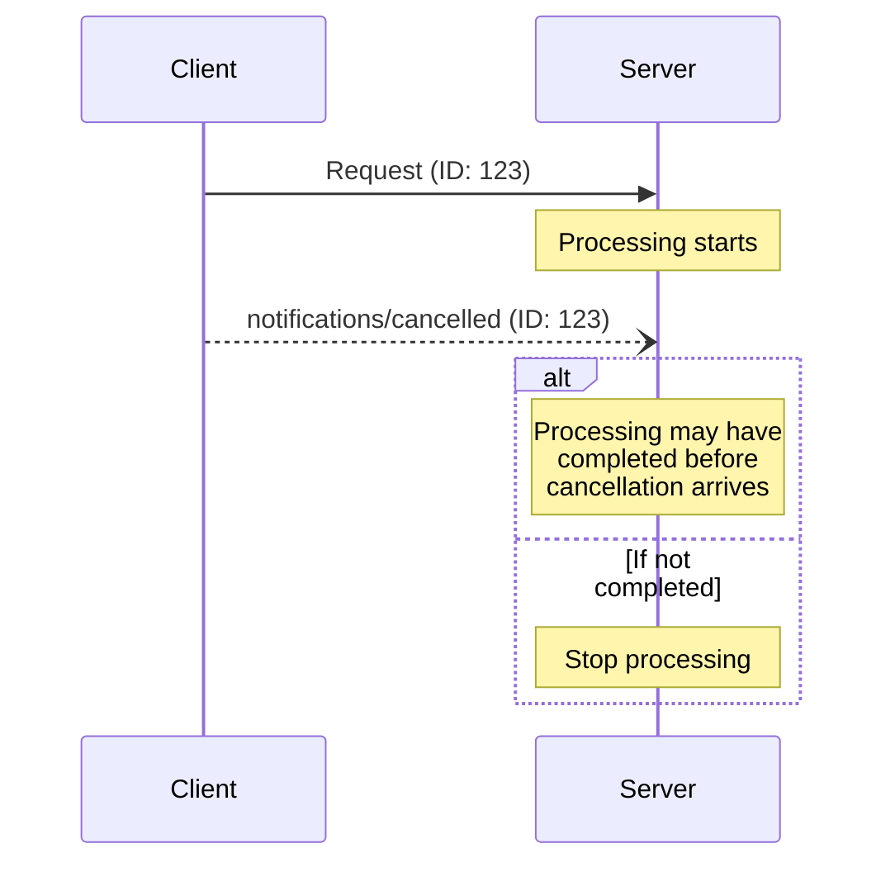

<Info>**协议修订版本**: 2024-11-05</Info>

模型上下文协议（MCP）支持通过通知消息对进行中的请求进行可选取消。协议双方均可发送取消通知来终止先前发出的请求。

## 取消流程

当一方需要取消进行中的请求时，应发送包含以下内容的`notifications/cancelled`通知：

- 待取消请求的ID
- 可选的说明字符串（用于记录或显示）

```json
{
  "jsonrpc": "2.0",
  "method": "notifications/cancelled",
  "params": {
    "requestId": "123",
    "reason": "User requested cancellation"
  }
}
```

## 行为规范

1. 取消通知**必须**仅引用符合以下条件的请求：
   - 先前通过相同通信方向发出
   - 被认定为仍在处理中
2. 客户端**禁止**取消`initialize`请求
3. 取消通知接收方**应当**：
   - 停止处理被取消的请求
   - 释放相关资源
   - 不再发送被取消请求的响应
4. 在以下情况下，接收方**可以**忽略取消通知：
   - 引用的请求ID未知
   - 请求处理已完成
   - 该请求不可取消
5. 取消通知发送方**应当**忽略后续到达的该请求响应

## 时序考量

由于网络延迟，取消通知可能在以下时机到达：
- 请求处理已完成之后
- 响应已发送之后

协议双方**必须**妥善处理这类竞态条件：



## 实现说明

- 双方**应当**记录取消原因以便调试
- 应用程序界面**应当**显示取消请求状态

## 错误处理

以下无效取消通知**应当**被忽略：
- 未知请求ID
- 已完成的请求
- 格式错误的通知

这种处理方式既保持了通知"发射后不管"的特性，又适应了异步通信中的竞态条件。