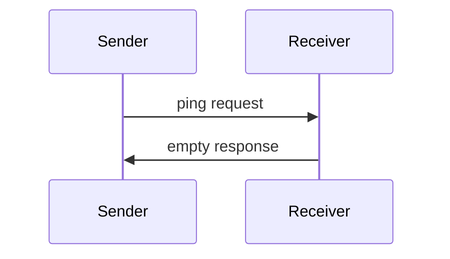

<Info>**协议修订版本**：2024-11-05</Info>

模型上下文协议包含可选的ping机制，允许通信双方验证对方是否仍保持响应且连接有效。

## 概述

ping功能通过简单的请求/响应模式实现。客户端或服务端均可通过发送`ping`请求发起ping检测。

## 消息格式

ping请求是一个无参数的标准JSON-RPC请求：

```json
{
  "jsonrpc": "2.0",
  "id": "123",
  "method": "ping"
}
```

## 行为规范

1. 接收方**必须**立即返回空响应：

```json
{
  "jsonrpc": "2.0",
  "id": "123",
  "result": {}
}
```

2. 若在合理超时时间内未收到响应，发送方**可以**：
   - 判定连接已失效
   - 终止连接
   - 尝试重新连接流程

## 使用模式



## 实现建议

- 实现方案**应当**定期发送ping以检测连接状态
- ping频率**应当**支持配置
- 超时设置**应当**适配网络环境
- **应当**避免过度ping检测以减少网络开销

## 错误处理

- **应当**将超时视为连接故障
- 多次ping失败**可以**触发连接重置
- 实现方案**应当**记录ping失败日志以供诊断