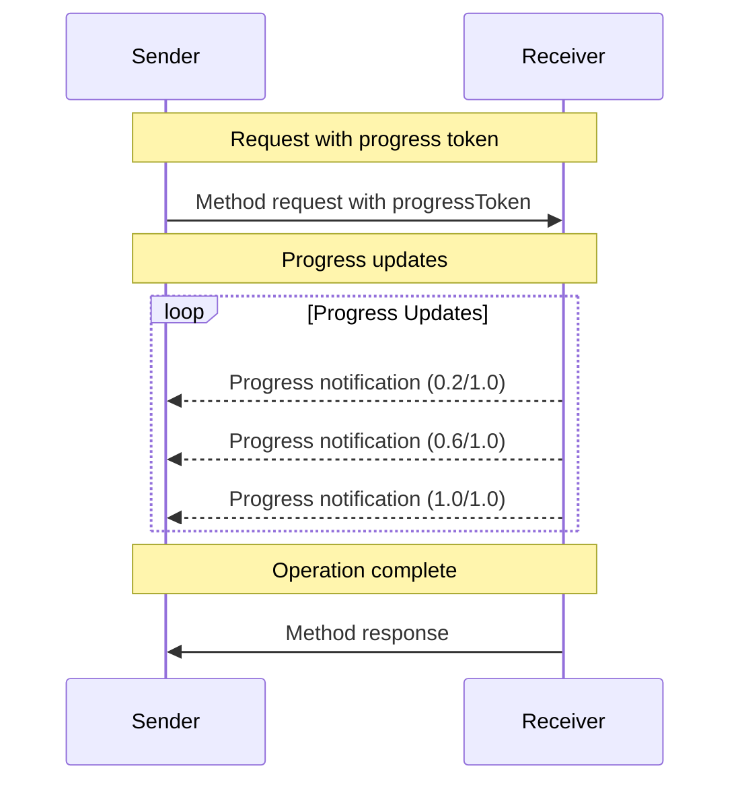

<Info>**协议修订版本**：2024-11-05</Info>

Model Context Protocol (MCP) 通过通知消息为长时间运行的操作提供可选的进度追踪功能。通信双方均可发送进度通知来更新操作状态。

## 进度流程

当一方需要接收请求的进度更新时，应在请求元数据中包含一个 `progressToken`。

- 进度令牌**必须**为字符串或整数值
- 发送方可采用任意方式生成进度令牌，但**必须**确保所有活跃请求间的令牌唯一性

```json
{
  "jsonrpc": "2.0",
  "id": 1,
  "method": "some_method",
  "params": {
    "_meta": {
      "progressToken": "abc123"
    }
  }
}
```

接收方随后**可以**发送包含以下内容的进度通知：

- 原始进度令牌
- 当前累计进度值
- 可选的"总量"值

```json
{
  "jsonrpc": "2.0",
  "method": "notifications/progress",
  "params": {
    "progressToken": "abc123",
    "progress": 50,
    "total": 100
  }
}
```

- `progress` 值**必须**随每次通知递增（即使总量未知）
- `progress` 和 `total` 值**可以**是浮点数

## 行为规范

1. 进度通知**必须**仅引用符合以下条件的令牌：

   - 来自活跃请求
   - 关联正在执行的操作

2. 进度请求的接收方**可以**：
   - 选择不发送任何进度通知
   - 按自定频率发送通知
   - 在总量未知时省略该值



## 实现说明

- 通信双方**应当**追踪活跃的进度令牌
- 双方**应当**实施速率限制防止消息洪泛
- 操作完成后**必须**停止发送进度通知