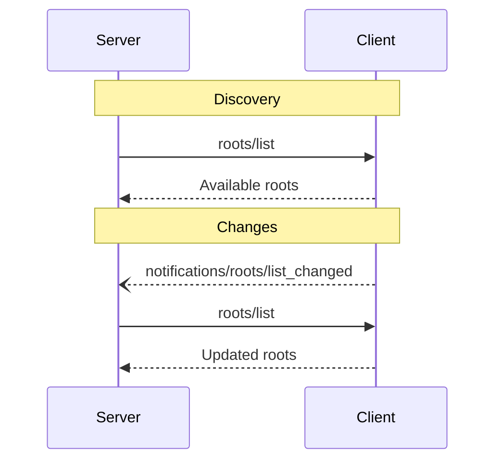

<Info>**协议修订版本**：2024-11-05</Info>

模型上下文协议（MCP）为客户端向服务端暴露文件系统"根目录"提供了标准化方案。根目录定义了服务端在文件系统中的操作边界，使其能够明确可访问的目录和文件范围。支持该功能的客户端可应服务端请求提供根目录列表，并在列表变更时发送通知。

## 用户交互模型

MCP中的根目录通常通过工作区或项目配置界面进行设置。

例如，具体实现可提供工作区/项目选择器，允许用户指定服务端应有权访问的目录和文件。该功能可与版本控制系统或项目文件的自动工作区检测结合使用。

但协议本身并不强制要求特定的用户交互模式——实现方可根据需求自由设计根目录的暴露方式。

## 能力声明

支持根目录功能的客户端**必须**在[初始化阶段](/specification/2024-11-05/basic/lifecycle#initialization)声明`roots`能力：

```json
{
  "capabilities": {
    "roots": {
      "listChanged": true
    }
  }
}
```

`listChanged`用于标识客户端是否会在根目录列表变更时发送通知。

## 协议消息

### 获取根目录列表

服务端通过发送`roots/list`请求获取根目录信息：

**请求：**

```json
{
  "jsonrpc": "2.0",
  "id": 1,
  "method": "roots/list"
}
```

**响应：**

```json
{
  "jsonrpc": "2.0",
  "id": 1,
  "result": {
    "roots": [
      {
        "uri": "file:///home/user/projects/myproject",
        "name": "My Project"
      }
    ]
  }
}
```

### 根目录列表变更

当根目录发生变化时，支持`listChanged`的客户端**必须**发送通知：

```json
{
  "jsonrpc": "2.0",
  "method": "notifications/roots/list_changed"
}
```

## 消息流程



## 数据类型

### 根目录定义

每个根目录包含以下属性：
- `uri`：根目录唯一标识符。在当前协议中**必须**为`file://`格式的URI
- `name`：可选的人类可读名称（用于显示）

不同场景下的根目录示例：

#### 项目目录

```json
{
  "uri": "file:///home/user/projects/myproject",
  "name": "My Project"
}
```

#### 多代码仓库

```json
[
  {
    "uri": "file:///home/user/repos/frontend",
    "name": "Frontend Repository"
  },
  {
    "uri": "file:///home/user/repos/backend",
    "name": "Backend Repository"
  }
]
```

## 错误处理

客户端**应当**针对常见错误返回标准JSON-RPC错误码：
- 客户端不支持根目录功能：`-32601`（方法未找到）
- 内部错误：`-32603`

错误示例：

```json
{
  "jsonrpc": "2.0",
  "id": 1,
  "error": {
    "code": -32601,
    "message": "Roots not supported",
    "data": {
      "reason": "Client does not have roots capability"
    }
  }
}
```

## 安全考量

1. 客户端**必须**：
   - 仅暴露具有适当权限的根目录
   - 验证所有根目录URI以防止路径遍历攻击
   - 实施完善的访问控制机制
   - 持续监控根目录可访问性

2. 服务端**应当**：
   - 处理根目录不可用的情况
   - 在操作中严格遵守根目录边界
   - 根据提供的根目录验证所有路径

## 实现指南

1. 客户端**应当**：
   - 在向服务端暴露根目录前获取用户确认
   - 提供清晰的根目录管理界面
   - 暴露前验证根目录可访问性
   - 监控根目录变更

2. 服务端**应当**：
   - 使用前检查根目录支持能力
   - 优雅处理根目录列表变更
   - 在操作中尊重根目录边界
   - 合理缓存根目录信息