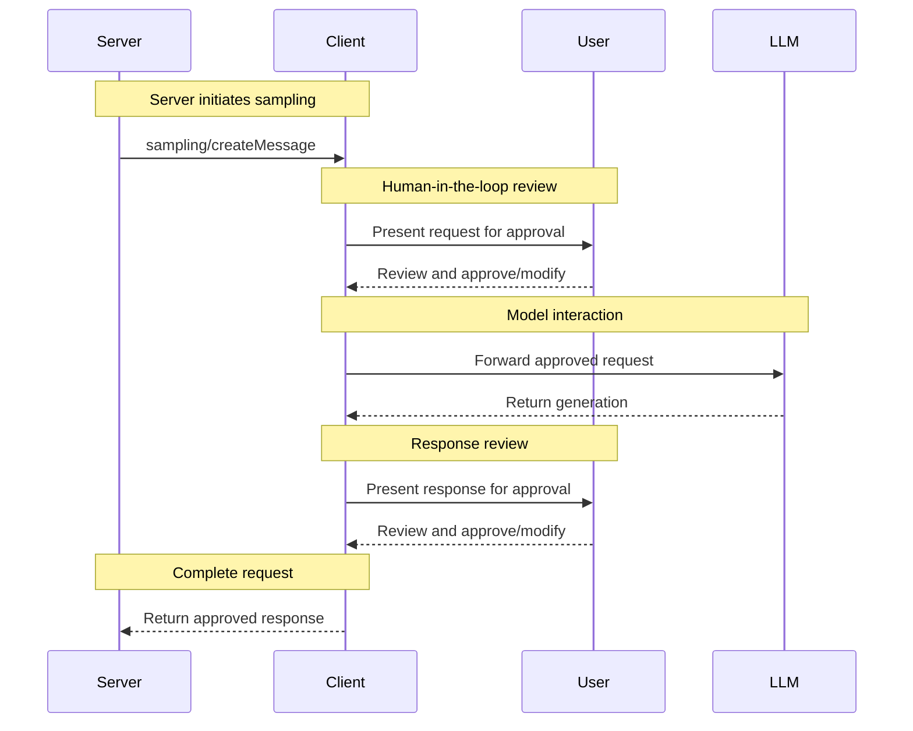

<Info>**协议修订版本**：2024-11-05</Info>

模型上下文协议（MCP）为服务端提供了一种标准化方式，通过客户端向大模型请求采样（"补全"或"生成"）。该流程允许客户端保持对模型访问、选择和权限的控制，同时使服务端能够利用AI能力——无需提供服务器API密钥。服务端可以请求基于文本或图像的交互，并选择性地在提示词中包含来自MCP服务端的上下文。

## 用户交互模型

MCP中的采样功能允许服务端通过在其他MCP服务端功能中_嵌套_调用大模型，实现智能体行为。

具体实现可自由选择适合其需求的任何接口模式来暴露采样功能——协议本身并不强制规定任何特定的用户交互模型。

<Warning>
For trust & safety and security, there **SHOULD** always
be a human in the loop with the ability to deny sampling requests.

Applications **SHOULD**:

- Provide UI that makes it easy and intuitive to review sampling requests
- Allow users to view and edit prompts before sending
- Present generated responses for review before delivery
</Warning>

## 能力声明

支持采样的客户端**必须**在[初始化阶段](/specification/2024-11-05/basic/lifecycle#initialization)声明`sampling`能力：

```json
{
  "capabilities": {
    "sampling": {}
  }
}
```

## 协议消息

### 创建消息

服务端通过发送`sampling/createMessage`请求来申请语言模型生成：

**请求：**

```json
{
  "jsonrpc": "2.0",
  "id": 1,
  "method": "sampling/createMessage",
  "params": {
    "messages": [
      {
        "role": "user",
        "content": {
          "type": "text",
          "text": "What is the capital of France?"
        }
      }
    ],
    "modelPreferences": {
      "hints": [
        {
          "name": "claude-3-sonnet"
        }
      ],
      "intelligencePriority": 0.8,
      "speedPriority": 0.5
    },
    "systemPrompt": "You are a helpful assistant.",
    "maxTokens": 100
  }
}
```

**响应：**

```json
{
  "jsonrpc": "2.0",
  "id": 1,
  "result": {
    "role": "assistant",
    "content": {
      "type": "text",
      "text": "The capital of France is Paris."
    },
    "model": "claude-3-sonnet-20240307",
    "stopReason": "endTurn"
  }
}
```

## 消息流程



## 数据类型

### 消息内容

采样消息可包含：

#### 文本内容

```json
{
  "type": "text",
  "text": "The message content"
}
```

#### 图像内容

```json
{
  "type": "image",
  "data": "base64-encoded-image-data",
  "mimeType": "image/jpeg"
}
```

### 模型偏好设置

MCP中的模型选择需要谨慎抽象化处理，因为服务端和客户端可能使用不同AI供应商提供的差异化模型。服务端不能简单地通过名称请求特定模型，因为客户端可能无法访问该确切模型，或更倾向于使用其他供应商的等效模型。

为此，MCP实现了一个结合抽象能力优先级与可选模型提示的偏好系统：

#### 能力优先级

服务端通过三个标准化优先级值（0-1）表达需求：

- `costPriority`：成本最小化的重要性？数值越高表示越倾向于廉价模型
- `speedPriority`：低延迟的重要性？数值越高表示越倾向于快速模型
- `intelligencePriority`：高级能力的重要性？数值越高表示越倾向于高性能模型

#### 模型提示

优先级帮助基于特征选择模型，而`hints`允许服务端建议特定模型或模型系列：

- 提示被视为可灵活匹配模型名称的子字符串
- 多个提示按优先顺序评估
- 客户端**可以**将提示映射到不同供应商的等效模型
- 提示仅供参考——客户端拥有最终模型选择权

例如：

```json
{
  "hints": [
    { "name": "claude-3-sonnet" }, // Prefer Sonnet-class models
    { "name": "claude" } // Fall back to any Claude model
  ],
  "costPriority": 0.3, // Cost is less important
  "speedPriority": 0.8, // Speed is very important
  "intelligencePriority": 0.5 // Moderate capability needs
}
```

客户端根据这些偏好从其可用选项中选择合适模型。例如，如果客户端无法访问Claude模型但拥有Gemini，可能会将sonnet提示映射到`gemini-1.5-pro`（基于相似能力）。

## 错误处理

客户端**应当**为常见故障返回错误：

示例错误：

```json
{
  "jsonrpc": "2.0",
  "id": 1,
  "error": {
    "code": -1,
    "message": "User rejected sampling request"
  }
}
```

## 安全考量

1. 客户端**应当**实现用户审批控制
2. 双方**应当**验证消息内容
3. 客户端**应当**尊重模型偏好提示
4. 客户端**应当**实施速率限制
5. 双方**必须**妥善处理敏感数据