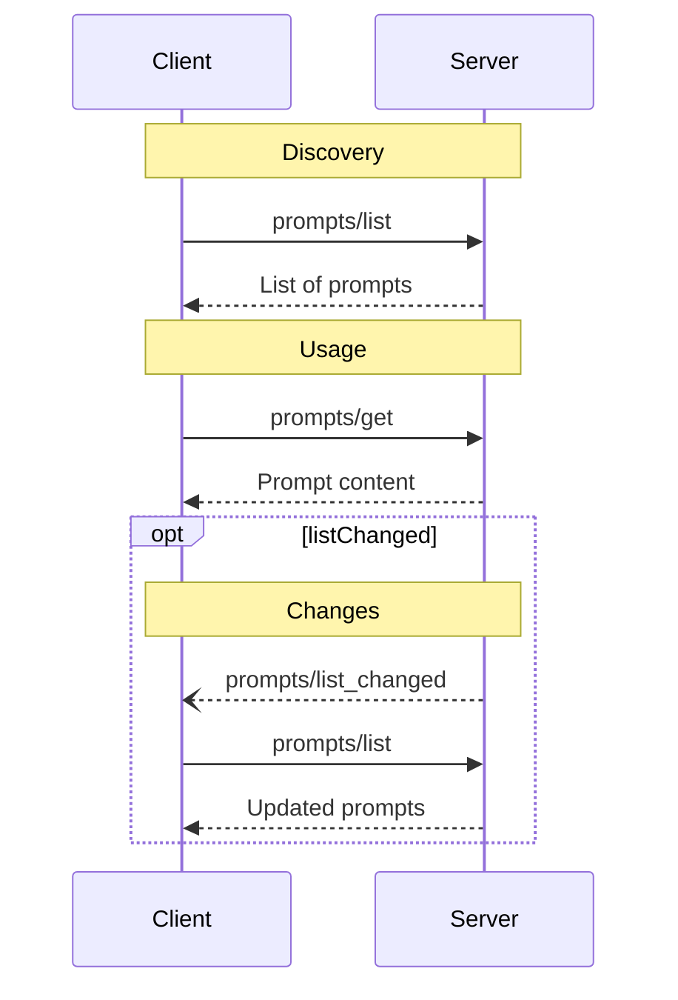

<Info>**协议修订版本**：2024-11-05</Info>

模型上下文协议（MCP）为服务端提供了一种标准化方式，使其能够向客户端暴露提示词模板。通过提示词，服务端可以为大模型交互提供结构化消息和指令。客户端可发现可用提示词、获取其内容，并通过参数进行自定义配置。

## 用户交互模型

提示词设计遵循**用户可控**原则，即服务端向客户端暴露提示词的目的是让用户能够显式选择使用。

通常，提示词会通过用户界面中的主动命令触发，这种设计让用户可以自然地发现并调用可用提示词。

例如以下斜杠命令形式：


但实现者可根据实际需求自由选择交互方式——协议本身并不强制规定具体的用户交互模型。

## 能力声明

支持提示词功能的服务端**必须**在[初始化阶段](/specification/2024-11-05/basic/lifecycle#initialization)声明`prompts`能力：

```json
{
  "capabilities": {
    "prompts": {
      "listChanged": true
    }
  }
}
```

`listChanged`用于标识服务端是否会在可用提示词列表变更时发送通知。

## 协议消息

### 获取提示词列表

客户端通过发送`prompts/list`请求获取可用提示词，该操作支持[分页机制](/specification/2024-11-05/server/utilities/pagination)。

**请求：**

```json
{
  "jsonrpc": "2.0",
  "id": 1,
  "method": "prompts/list",
  "params": {
    "cursor": "optional-cursor-value"
  }
}
```

**响应：**

```json
{
  "jsonrpc": "2.0",
  "id": 1,
  "result": {
    "prompts": [
      {
        "name": "code_review",
        "description": "Asks the LLM to analyze code quality and suggest improvements",
        "arguments": [
          {
            "name": "code",
            "description": "The code to review",
            "required": true
          }
        ]
      }
    ],
    "nextCursor": "next-page-cursor"
  }
}
```

### 获取单个提示词

客户端通过发送`prompts/get`请求获取特定提示词，参数可通过[自动补全API](/specification/2024-11-05/server/utilities/completion)实现自动填充。

**请求：**

```json
{
  "jsonrpc": "2.0",
  "id": 2,
  "method": "prompts/get",
  "params": {
    "name": "code_review",
    "arguments": {
      "code": "def hello():\n    print('world')"
    }
  }
}
```

**响应：**

```json
{
  "jsonrpc": "2.0",
  "id": 2,
  "result": {
    "description": "Code review prompt",
    "messages": [
      {
        "role": "user",
        "content": {
          "type": "text",
          "text": "Please review this Python code:\ndef hello():\n    print('world')"
        }
      }
    ]
  }
}
```

### 列表变更通知

当可用提示词列表发生变化时，已声明`listChanged`能力的服务端**应当**发送通知：

```json
{
  "jsonrpc": "2.0",
  "method": "notifications/prompts/list_changed"
}
```

## 消息流程



## 数据类型

### 提示词定义

每个提示词包含以下要素：
- `name`：提示词唯一标识符
- `description`：可选的人类可读描述
- `arguments`：可选的自定义参数列表

### 提示词消息

提示词消息可包含以下内容：
- `role`："user"或"assistant"标识发言者身份
- `content`：下列内容类型之一：

#### 文本内容

文本内容表示纯文字消息：

```json
{
  "type": "text",
  "text": "The text content of the message"
}
```

这是自然语言交互中最常用的内容类型。

#### 图像内容

图像内容允许在消息中包含视觉信息：

```json
{
  "type": "image",
  "data": "base64-encoded-image-data",
  "mimeType": "image/png"
}
```

图像数据**必须**采用base64编码并包含有效MIME类型，这对于需要视觉上下文的多模态交互至关重要。

#### 嵌入式资源

嵌入式资源允许在消息中直接引用服务端资源：

```json
{
  "type": "resource",
  "resource": {
    "uri": "resource://example",
    "mimeType": "text/plain",
    "text": "Resource content"
  }
}
```

资源可包含文本或二进制数据，且**必须**包含：
- 有效资源URI
- 正确的MIME类型
- 文本内容或base64编码的二进制数据

该功能使得提示词能够无缝集成服务端管理的内容（如文档、代码示例等参考材料）到对话流程中。

## 错误处理

服务端**应当**针对以下常见错误返回标准JSON-RPC错误码：
- 无效提示词名称：`-32602`（参数无效）
- 缺少必要参数：`-32602`（参数无效）
- 内部错误：`-32603`（内部错误）

## 实现建议

1. 服务端**应当**在处理前验证提示词参数
2. 客户端**应当**对大型提示词列表实现分页处理
3. 双方**应当**遵循能力协商机制

## 安全规范

实现方**必须**严格验证所有提示词的输入输出，防止注入攻击或对资源的未授权访问。