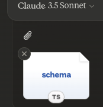
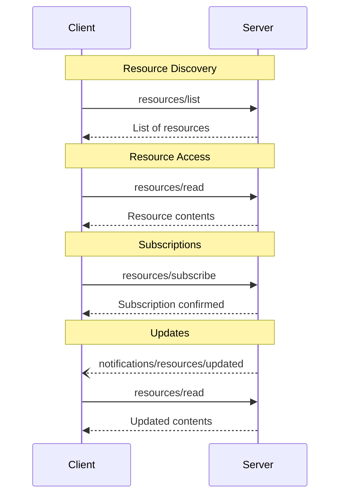

<Info>**协议修订版本**：2024-11-05</Info>

模型上下文协议（MCP）为服务器提供了一种标准化方式，使其能够向客户端公开资源。这些资源允许服务器共享为大模型提供上下文的数据，例如文件、数据库模式或特定应用信息。每个资源通过[URI](https://datatracker.ietf.org/doc/html/rfc3986)进行唯一标识。

## 用户交互模型

MCP中的资源设计遵循**应用驱动**原则，由宿主应用根据自身需求决定如何整合上下文。

例如，应用可以：
- 通过树形或列表视图的UI元素显式暴露资源供用户选择
- 允许用户搜索和筛选可用资源
- 基于启发式规则或AI模型的选择自动包含上下文



但具体实现可自由采用任何适合其需求的界面模式——协议本身并不强制规定特定的用户交互模型。

## 能力声明

支持资源的服务器**必须**声明`resources`能力：

```json
{
  "capabilities": {
    "resources": {
      "subscribe": true,
      "listChanged": true
    }
  }
}
```

该能力支持两个可选特性：
- `subscribe`：客户端是否可以订阅单个资源的变更通知
- `listChanged`：服务器是否会在可用资源列表变更时发出通知

`subscribe`和%%PH_d6e802b%%都是可选的——服务器可以选择不支持、支持其中一项或同时支持两项：

```json
{
  "capabilities": {
    "resources": {} // Neither feature supported
  }
}
```

```json
{
  "capabilities": {
    "resources": {
      "subscribe": true // Only subscriptions supported
    }
  }
}
```

```json
{
  "capabilities": {
    "resources": {
      "listChanged": true // Only list change notifications supported
    }
  }
}
```

## 协议消息

### 资源列表查询

客户端发送`resources/list`请求来发现可用资源。该操作支持[分页](/specification/2024-11-05/server/utilities/pagination)。

**请求：**

```json
{
  "jsonrpc": "2.0",
  "id": 1,
  "method": "resources/list",
  "params": {
    "cursor": "optional-cursor-value"
  }
}
```

**响应：**

```json
{
  "jsonrpc": "2.0",
  "id": 1,
  "result": {
    "resources": [
      {
        "uri": "file:///project/src/main.rs",
        "name": "main.rs",
        "description": "Primary application entry point",
        "mimeType": "text/x-rust"
      }
    ],
    "nextCursor": "next-page-cursor"
  }
}
```

### 资源内容读取

客户端发送`resources/read`请求获取资源内容：

**请求：**

```json
{
  "jsonrpc": "2.0",
  "id": 2,
  "method": "resources/read",
  "params": {
    "uri": "file:///project/src/main.rs"
  }
}
```

**响应：**

```json
{
  "jsonrpc": "2.0",
  "id": 2,
  "result": {
    "contents": [
      {
        "uri": "file:///project/src/main.rs",
        "mimeType": "text/x-rust",
        "text": "fn main() {\n    println!(\"Hello world!\");\n}"
      }
    ]
  }
}
```

### 资源模板

资源模板允许服务器使用[URI模板](https://datatracker.ietf.org/doc/html/rfc6570)暴露参数化资源。参数可通过[补全API](/specification/2024-11-05/server/utilities/completion)自动填充。

**请求：**

```json
{
  "jsonrpc": "2.0",
  "id": 3,
  "method": "resources/templates/list"
}
```

**响应：**

```json
{
  "jsonrpc": "2.0",
  "id": 3,
  "result": {
    "resourceTemplates": [
      {
        "uriTemplate": "file:///{path}",
        "name": "Project Files",
        "description": "Access files in the project directory",
        "mimeType": "application/octet-stream"
      }
    ]
  }
}
```

### 资源列表变更通知

当可用资源列表发生变化时，已声明`listChanged`能力的服务器**应当**发送通知：

```json
{
  "jsonrpc": "2.0",
  "method": "notifications/resources/list_changed"
}
```

### 订阅机制

协议支持可选的资源变更订阅。客户端可订阅特定资源并在其变更时接收通知：

**订阅请求：**

```json
{
  "jsonrpc": "2.0",
  "id": 4,
  "method": "resources/subscribe",
  "params": {
    "uri": "file:///project/src/main.rs"
  }
}
```

**更新通知：**

```json
{
  "jsonrpc": "2.0",
  "method": "notifications/resources/updated",
  "params": {
    "uri": "file:///project/src/main.rs"
  }
}
```

## 消息流程



## 数据类型

### 资源定义

资源定义包含：
- `uri`：资源的唯一标识符
- `name`：人类可读的名称
- `description`：可选描述
- `mimeType`：可选MIME类型

### 资源内容

资源可包含文本或二进制数据：

#### 文本内容

```json
{
  "uri": "file:///example.txt",
  "mimeType": "text/plain",
  "text": "Resource content"
}
```

#### 二进制内容

```json
{
  "uri": "file:///example.png",
  "mimeType": "image/png",
  "blob": "base64-encoded-data"
}
```

## 通用URI方案

协议定义了几种标准URI方案。此列表并非穷尽——实现方始终可以使用额外的自定义URI方案。

### https://

表示可通过网络获取的资源。

服务器**应当**仅在客户端能够自行从网络直接获取该资源时（即不需要通过MCP服务器读取）使用此方案。

对于其他用例，服务器**应当**优先使用其他URI方案或自定义方案，即使服务器自身将通过互联网下载资源内容。

### file://

用于标识行为类似文件系统的资源。但这些资源不需要映射到实际物理文件系统。

MCP服务器**可以**为file://资源指定[XDG MIME类型](https://specifications.freedesktop.org/shared-mime-info-spec/0.14/ar01s02.html#id-1.3.14)，如`inode/directory`来表示非常规文件（如目录）等没有标准MIME类型的资源。

### git://

Git版本控制集成。

## 错误处理

服务器**应当**为常见错误返回标准JSON-RPC错误码：
- 资源未找到：`-32002`
- 内部错误：`-32603`

错误示例：

```json
{
  "jsonrpc": "2.0",
  "id": 5,
  "error": {
    "code": -32002,
    "message": "Resource not found",
    "data": {
      "uri": "file:///nonexistent.txt"
    }
  }
}
```

## 安全考量

1. 服务器**必须**验证所有资源URI
2. 对敏感资源**应当**实施访问控制
3. 二进制数据**必须**经过正确编码
4. 执行操作前**应当**检查资源权限