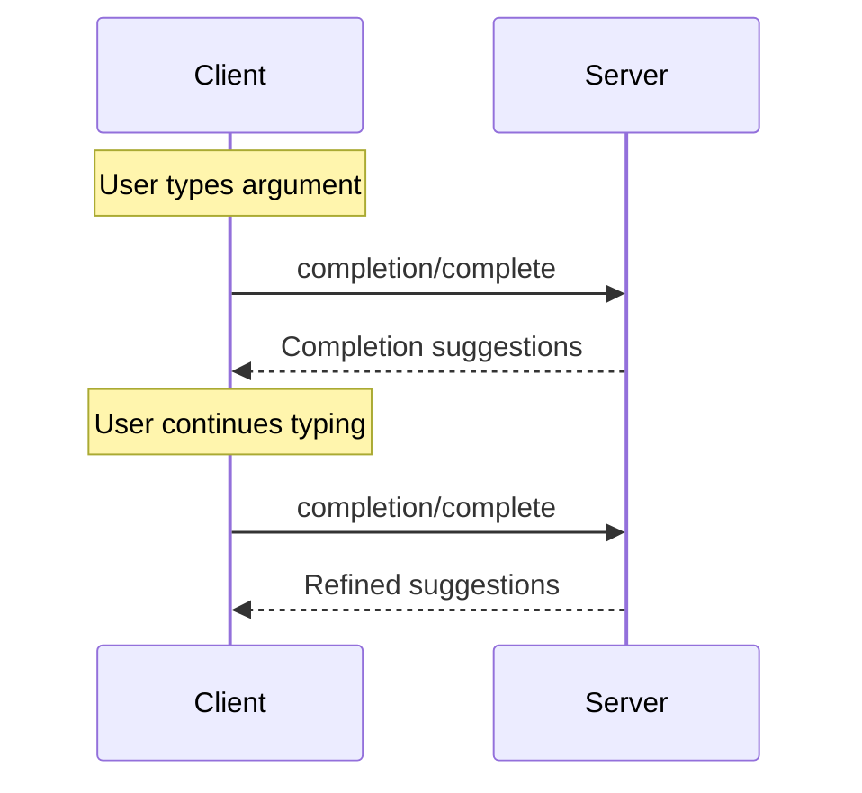

<Info>**协议修订版本**：2024-11-05</Info>

模型上下文协议（MCP）为服务器提供了一种标准化方式，用于为提示词和资源URI提供参数自动补全建议。这使得用户可以在输入参数值时获得上下文建议，实现类似IDE的丰富体验。

## 用户交互模型

MCP中的补全功能旨在支持类似IDE代码补全的交互式用户体验。

例如，应用程序可以在用户输入时以下拉菜单或弹出窗口的形式显示补全建议，并提供筛选和选择可用选项的功能。

但具体实现可以自由选择适合其需求的任何界面模式来展示补全功能——协议本身并不强制规定特定的用户交互模型。

## 协议消息

### 请求补全建议

客户端通过发送`completion/complete`请求获取补全建议，该请求通过引用类型指定要补全的内容：

**请求：**

```json
{
  "jsonrpc": "2.0",
  "id": 1,
  "method": "completion/complete",
  "params": {
    "ref": {
      "type": "ref/prompt",
      "name": "code_review"
    },
    "argument": {
      "name": "language",
      "value": "py"
    }
  }
}
```

**响应：**

```json
{
  "jsonrpc": "2.0",
  "id": 1,
  "result": {
    "completion": {
      "values": ["python", "pytorch", "pyside"],
      "total": 10,
      "hasMore": true
    }
  }
}
```

### 引用类型

该协议支持两种补全引用类型：

| Type           | Description                 | Example                                             |
| -------------- | --------------------------- | --------------------------------------------------- |
| `ref/prompt`   | References a prompt by name | `{"type": "ref/prompt", "name": "code_review"}`     |
| `ref/resource` | References a resource URI   | `{"type": "ref/resource", "uri": "file:///{path}"}` |

### 补全结果

服务器返回按相关性排序的补全值数组，其中包含：
- 每个响应最多100条结果
- 可选的匹配项总数
- 布尔值标识是否存在更多结果

## 消息流程



## 数据类型

### CompleteRequest
- `ref`：`PromptReference`或`ResourceReference`
- `argument`：包含以下字段的对象：
  - `name`：参数名称
  - `value`：当前值

### CompleteResult
- `completion`：包含以下字段的对象：
  - `values`：建议数组（最多100条）
  - `total`：可选的匹配总数
  - `hasMore`：额外结果标志位

## 实现注意事项

1. 服务器**应当**：
   - 按相关性排序返回建议
   - 在适当场景实现模糊匹配
   - 对补全请求进行速率限制
   - 验证所有输入参数

2. 客户端**应当**：
   - 对频繁的补全请求进行防抖处理
   - 在适当场景缓存补全结果
   - 优雅处理缺失或不完整的返回结果

## 安全性

实现方案**必须**：
- 验证所有补全输入
- 实施适当的速率限制
- 控制对敏感建议的访问权限
- 防止基于补全的信息泄露