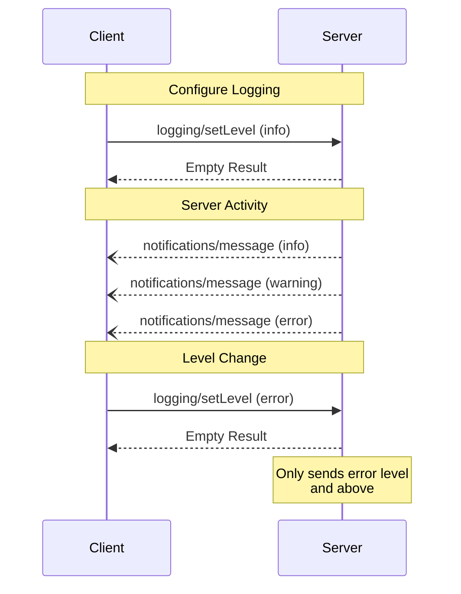

<Info>**协议修订版本**: 2024-11-05</Info>

模型上下文协议（MCP）为服务器提供了一种标准化方式，用于向客户端发送结构化日志消息。客户端可通过设置最低日志级别来控制日志详细程度，服务器发送的通知包含严重级别、可选的记录器名称以及任意可JSON序列化的数据。

## 用户交互模型

具体实现可自由选择适合其需求的任何界面模式来展示日志功能——协议本身并不强制规定特定的用户交互模型。

## 能力声明

发送日志消息通知的服务器**必须**声明`logging`能力：

```json
{
  "capabilities": {
    "logging": {}
  }
}
```

## 日志级别

本协议遵循[RFC 5424](https://datatracker.ietf.org/doc/html/rfc5424#section-6.2.1)定义的标准系统日志严重级别：

| Level     | Description                      | Example Use Case           |
| --------- | -------------------------------- | -------------------------- |
| debug     | Detailed debugging information   | Function entry/exit points |
| info      | General informational messages   | Operation progress updates |
| notice    | Normal but significant events    | Configuration changes      |
| warning   | Warning conditions               | Deprecated feature usage   |
| error     | Error conditions                 | Operation failures         |
| critical  | Critical conditions              | System component failures  |
| alert     | Action must be taken immediately | Data corruption detected   |
| emergency | System is unusable               | Complete system failure    |

## 协议消息

### 设置日志级别

客户端**可以**发送`logging/setLevel`请求来配置最低日志级别：

**请求：**

```json
{
  "jsonrpc": "2.0",
  "id": 1,
  "method": "logging/setLevel",
  "params": {
    "level": "info"
  }
}
```

### 日志消息通知

服务器使用`notifications/message`通知发送日志消息：

```json
{
  "jsonrpc": "2.0",
  "method": "notifications/message",
  "params": {
    "level": "error",
    "logger": "database",
    "data": {
      "error": "Connection failed",
      "details": {
        "host": "localhost",
        "port": 5432
      }
    }
  }
}
```

## 消息流程



## 错误处理

服务器**应当**针对常见错误返回标准JSON-RPC错误：

- 无效日志级别：`-32602`（参数无效）
- 配置错误：`-32603`（内部错误）

## 实现注意事项

1. 服务器**应当**：
   - 对日志消息进行速率限制
   - 在data字段中包含相关上下文
   - 使用一致的记录器名称
   - 移除敏感信息

2. 客户端**可以**：
   - 在用户界面展示日志消息
   - 实现日志过滤/搜索功能
   - 可视化显示严重级别
   - 持久化存储日志消息

## 安全规范

1. 日志消息**禁止**包含：
   - 凭据或密钥
   - 个人身份识别信息
   - 可能协助攻击的内部系统细节

2. 具体实现**应当**：
   - 限制消息速率
   - 验证所有数据字段
   - 控制日志访问权限
   - 监控敏感内容