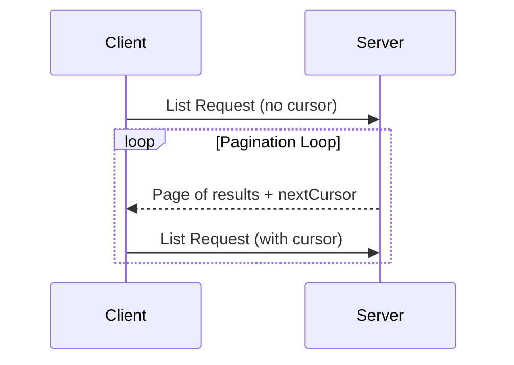

<Info>**协议修订版本**: 2024-11-05</Info>

模型上下文协议（MCP）支持对可能返回大量结果集的列表操作进行分页处理。分页机制允许服务端以较小数据块的形式返回结果，而非一次性返回全部数据。

当通过互联网连接外部服务时，分页机制尤为重要。同时对于本地集成场景，该机制也能有效避免大数据集导致的性能问题。

## 分页模型

MCP采用基于不透明游标的分页方案，而非传统的页码分页方式：

- **游标**是一个不透明的字符串令牌，代表结果集中的特定位置
- **分页大小**由服务端决定，客户端**禁止**假定固定分页尺寸

## 响应格式

当服务端发送的**响应**包含以下内容时，即触发分页机制：
- 当前页的结果数据
- 可选字段 `nextCursor`（当存在更多结果时）

```json
{
  "jsonrpc": "2.0",
  "id": "123",
  "result": {
    "resources": [...],
    "nextCursor": "eyJwYWdlIjogM30="
  }
}
```

## 请求格式

客户端在获取游标后，可通过在请求中包含该游标来**继续**分页操作：

```json
{
  "jsonrpc": "2.0",
  "method": "resources/list",
  "params": {
    "cursor": "eyJwYWdlIjogMn0="
  }
}
```

## 分页流程



## 支持分页的操作

以下MCP操作支持分页机制：
- `resources/list` - 列出可用资源
- `resources/templates/list` - 列出资源模板
- `prompts/list` - 列出可用提示词
- `tools/list` - 列出可用工具

## 实现指南

1. 服务端**应当**：
   - 提供稳定的游标
   - 妥善处理无效游标

2. 客户端**应当**：
   - 将缺失的 `nextCursor` 字段视为结果终止标志
   - 同时支持分页与非分页流程

3. 客户端**必须**将游标视为不透明令牌：
   - 不可对游标格式做任何假设
   - 不可尝试解析或修改游标
   - 不可跨会话持久化游标

## 错误处理

无效游标**应当**返回-32602错误代码（参数无效）。