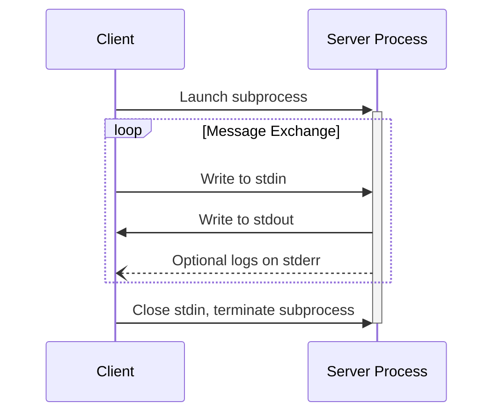
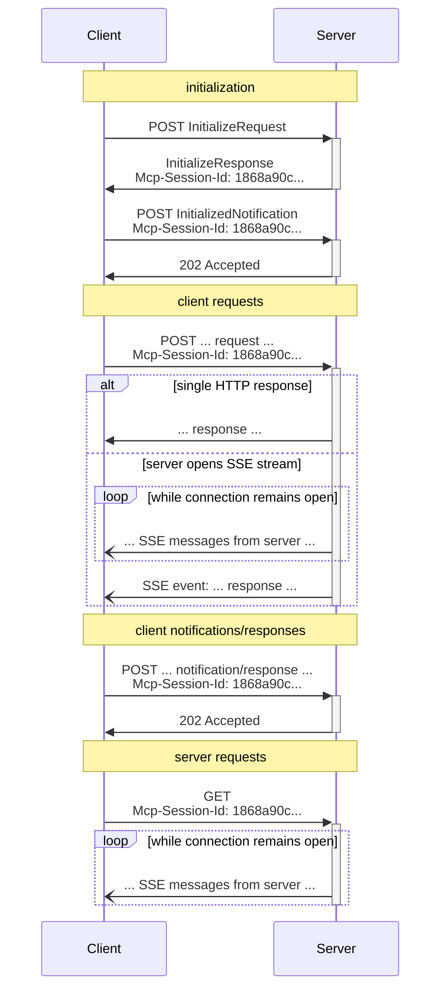

<Info>**协议修订版本**: 2025-03-26</Info>

MCP 采用 JSON-RPC 进行消息编码，所有 JSON-RPC 消息**必须**使用 UTF-8 编码。

当前协议定义了两种标准的客户端-服务端通信传输机制：

1. [标准输入输出](#stdio)（通过标准输入和标准输出通信）
2. [可流式 HTTP](#streamable-http)

客户端**应当**尽可能支持标准输入输出传输。

客户端和服务端也可以以插件方式实现[自定义传输机制](#custom-transports)。

## 标准输入输出

在**标准输入输出**传输模式下：

- 客户端将 MCP 服务端作为子进程启动
- 服务端从标准输入（`stdin`）读取 JSON-RPC 消息，并通过标准输出（`stdout`）发送消息
- 消息可以是 JSON-RPC 请求、通知、响应，或是包含一个或多个请求/通知的 JSON-RPC [批量消息](https://www.jsonrpc.org/specification#batch)
- 消息以换行符分隔，且**不得**包含内嵌换行符
- 服务端**可以**向标准错误（`stderr`）输出 UTF-8 字符串用于日志记录，客户端**可以**捕获、转发或忽略这些日志
- 服务端**不得**向 `stdout` 写入任何非法的 MCP 消息
- 客户端**不得**向服务端的 `stdin` 写入任何非法的 MCP 消息

## 可流式 HTTP

<Info>This replaces the [HTTP+SSE
transport](/specification/2024-11-05/basic/transports#http-with-sse) from
protocol version 2024-11-05. See the [backwards compatibility](#backwards-compatibility)
guide below.</Info>

在**可流式 HTTP**传输模式下，服务端作为独立进程运行，可处理多个客户端连接。该传输机制使用 HTTP POST 和 GET 请求，服务端可选择性地采用[服务器推送事件](https://en.wikipedia.org/wiki/Server-sent_events)（SSE）来实现多消息流式传输。这种设计既支持基础 MCP 服务端，也支持具备流式传输和服务端主动通知/请求功能的高级服务端。

服务端**必须**提供单一的 HTTP 端点路径（下文称为**MCP端点**），同时支持 POST 和 GET 方法。例如可以是类似 `https://example.com/mcp` 的 URL。

#### 安全警告

实现可流式 HTTP 传输时需注意：

1. 服务端**必须**验证所有连接的 `Origin` 头部，防止 DNS 重绑定攻击
2. 本地运行时，服务端**应当**仅绑定到本地回环地址（127.0.0.1），而非所有网络接口（0.0.0.0）
3. 服务端**应当**为所有连接实施适当的认证机制

若缺乏这些保护措施，攻击者可能通过 DNS 重绑定技术远程访问本地 MCP 服务端。

### 向服务端发送消息

每个从客户端发送的 JSON-RPC 消息**必须**作为独立的 HTTP POST 请求发送至 MCP 端点：

1. 客户端**必须**使用 HTTP POST 方法向 MCP 端点发送 JSON-RPC 消息
2. 客户端**必须**包含 `Accept` 头部，声明同时支持 `application/json` 和 `text/event-stream` 内容类型
3. POST 请求体**必须**是以下形式之一：
   - 单个 JSON-RPC _请求_、_通知_ 或 _响应_
   - 包含一个或多个_请求/通知_的[批量消息](https://www.jsonrpc.org/specification#batch)数组
   - 包含一个或多个_响应_的[批量消息](https://www.jsonrpc.org/specification#batch)数组
4. 若输入仅包含 JSON-RPC _响应_ 或 _通知_：
   - 服务端接受输入时**必须**返回 HTTP 202 Accepted 状态码（无响应体）
   - 服务端拒绝输入时**必须**返回 HTTP 错误状态码（如 400 Bad Request），响应体**可以**包含不带 `id` 的 JSON-RPC 错误响应
5. 若输入包含 JSON-RPC _请求_，服务端**必须**返回 `Content-Type: text/event-stream`（初始化 SSE 流）或 `Content-Type: application/json`（返回单个 JSON 对象），客户端**必须**支持这两种情况
6. 若服务端初始化 SSE 流：
   - SSE 流**应当**最终为每个 POST 请求体中的 JSON-RPC _请求_ 返回对应响应（可[批量发送](https://www.jsonrpc.org/specification#batch)）
   - 服务端**可以**在发送响应前先发送请求和通知（应关联原始客户端请求，可[批量发送](https://www.jsonrpc.org/specification#batch)）
   - 除非[会话](#session-management)过期，服务端**不应**在返回所有请求的响应前关闭 SSE 流
   - 发送完所有响应后，服务端**应当**关闭 SSE 流
   - 连接可能随时中断（如网络问题），因此：
     - 连接中断**不应**视为客户端取消请求
     - 取消请求时客户端**应当**显式发送 MCP `CancelledNotification`
     - 为避免消息丢失，服务端**可以**使流支持[断点续传](#resumability-and-redelivery)

### 接收服务端消息

1. 客户端**可以**向 MCP 端点发起 HTTP GET 请求来开启 SSE 流，使得服务端能在客户端未发送 POST 请求时主动通信
2. 客户端**必须**包含 `Accept` 头部，声明支持 `text/event-stream` 内容类型
3. 服务端**必须**返回 `Content-Type: text/event-stream` 或 HTTP 405 Method Not Allowed（表示不支持 SSE 流）
4. 若服务端初始化 SSE 流：
   - 服务端**可以**通过流发送 JSON-RPC _请求_ 和 _通知_（可[批量发送](https://www.jsonrpc.org/specification#batch)）
   - 这些消息**应当**与客户端当前请求无关
   - 除非是[续传](#resumability-and-redelivery)先前请求的流，服务端**不得**发送 JSON-RPC _响应_
   - 服务端和客户端**可以**随时关闭 SSE 流

### 多连接处理

1. 客户端**可以**同时保持多个 SSE 流连接
2. 服务端**必须**将每个 JSON-RPC 消息仅发送至一个连接流（即**不得**跨流广播相同消息）
   - 可通过[断点续传](#resumability-and-redelivery)机制降低消息丢失风险

### 断点续传与消息重发

为支持连接恢复和消息重传：

1. 服务端**可以**按照 [SSE 标准](https://html.spec.whatwg.org/multipage/server-sent-events.html#event-stream-interpretation)为事件添加 `id` 字段
   - 该 ID **必须**在[会话](#session-management)内全局唯一（未启用会话管理时则在客户端范围内唯一）
2. 客户端续传连接时**应当**发起含 [`Last-Event-ID`](https://html.spec.whatwg.org/multipage/server-sent-events.html#the-last-event-id-header) 头部的 HTTP GET 请求
   - 服务端**可以**根据该头部重放断连后应发送的消息（仅限原数据流）
   - 服务端**不得**重放其他数据流的消息

简言之，事件 ID 应作为特定数据流内部的游标使用。

### 会话管理

MCP "会话"指客户端与服务端从[初始化阶段](/specification/2025-03-26/basic/lifecycle)开始的一系列逻辑关联交互。为实现有状态会话：

1. 使用可流式 HTTP 传输的服务端**可以**在初始化时通过 `Mcp-Session-Id` 头部分配会话 ID（随 `InitializeResult` 返回）
   - 会话 ID **应当**是全局唯一且加密安全的（如安全生成的 UUID/JWT/哈希值）
   - 会话 ID **必须**仅包含可见 ASCII 字符（0x21-0x7E）
2. 若初始化返回 `Mcp-Session-Id`，客户端后续请求**必须**携带 `Mcp-Session-Id` 头部
   - 需要会话 ID 的服务端**应当**对未携带 `Mcp-Session-Id` 的请求返回 HTTP 400 Bad Request
3. 服务端**可以**随时终止会话，之后对相关会话 ID 的请求**必须**返回 HTTP 404 Not Found
4. 客户端收到含 `Mcp-Session-Id` 请求的 HTTP 404 响应时，**必须**通过发送不含会话 ID 的新 `InitializeRequest` 来建立新会话
5. 客户端不再需要会话时（如应用退出），**应当**发送含 `Mcp-Session-Id` 头部的 HTTP DELETE 请求显式终止会话
   - 服务端**可以**返回 HTTP 405 Method Not Allowed 表示不支持主动终止

### 时序图

### 向后兼容性

客户端和服务端可通过以下方式保持与已弃用的 [HTTP+SSE 传输](/specification/2024-11-05/basic/transports#http-with-sse)（2024-11-05 协议版本）的兼容：

**服务端**需支持旧版客户端时应当：
- 在提供新版 MCP 端点的同时，继续维护旧版传输的 SSE 和 POST 端点
- 也可合并新旧端点，但可能增加复杂性

**客户端**需支持旧版服务端时应当：
1. 允许用户指定 MCP 服务端 URL（可能指向新旧任一版本）
2. 尝试按新规范 POST `InitializeRequest`（含 `Accept` 头部）：
   - 成功则判定为新版传输
   - 若收到 HTTP 4xx 错误（如 405/404）：
     - 发起 GET 请求并期待首个事件为 `endpoint`
     - 收到 `endpoint` 事件后判定为旧版传输，后续采用旧版通信方式

## 自定义传输

客户端和服务端**可以**实现额外的自定义传输机制以满足特定需求。协议本身与传输方式无关，可在任何支持双向消息交换的通信通道上实现。

选择实现自定义传输时**必须**确保：
- 保持 MCP 定义的 JSON-RPC 消息格式和生命周期要求
- **应当**详细记录连接建立和消息交换模式以保障互操作性